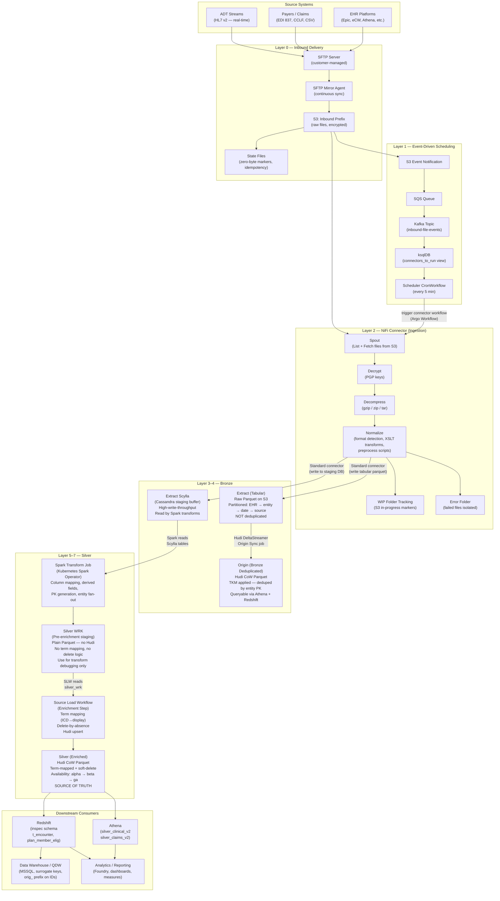
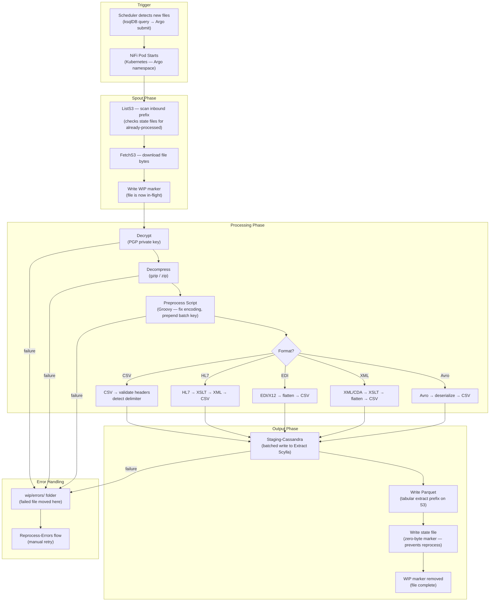
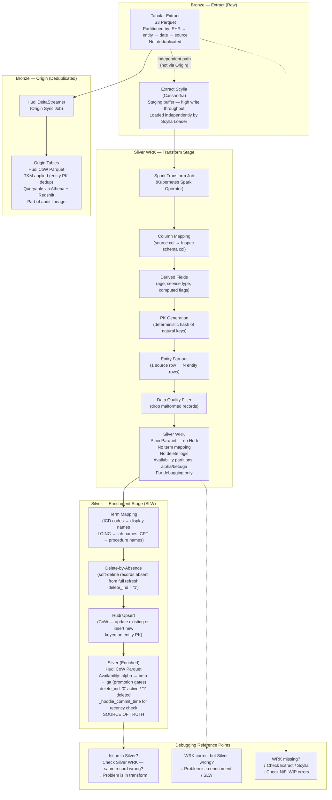
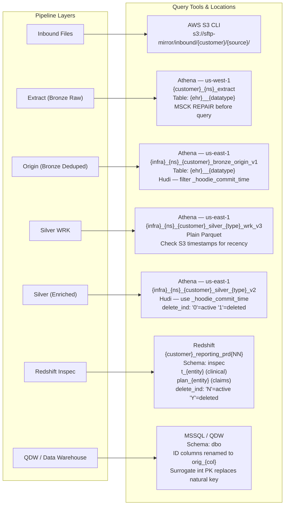

# Data Pipeline Architecture — Mermaid Diagrams
### Inbound → Bronze → Silver

---

## Diagram 1 — Full Pipeline Overview (End-to-End)

**Question it answers:** *How does data flow from a source system to the Silver layer, and what are the major checkpoints?*

**Architecture takeaways:**
- NiFi is the **ingestion boundary** — everything before it is delivery, everything after is transformation
- **Two independent paths** run from Extract: one to Origin (Bronze dedup), one to Scylla → Spark → Silver
- Silver WRK is a **staging area, not a data product** — enrich before exposing downstream
- Hudi is used at **Origin** and **Silver** for upsert semantics and time-travel
- The Kafka/ksqlDB/Scheduler pattern decouples **file arrival** from **connector execution**

---

## Diagram 2 — NiFi Connector Internals (Ingestion Deep Dive)

**Question it answers:** *What exactly happens inside a single connector run from file pickup to output?*

**Connector internals takeaways:**
- **State files** are the idempotency mechanism — one zero-byte marker per processed file
- **WIP folder** is the progress tracker — a file stuck in WIP means the run failed mid-flight
- Format conversion happens **inside NiFi** before any Spark job runs
- Errors are **isolated per file** — one bad file cannot block the others
- The connector pod **terminates after the run** — it is not a long-lived process (for batch connectors)

---

## Diagram 3 — Bronze to Silver Transformation Flow

**Question it answers:** *How does raw Extract data become enriched Silver data?*

**Transformation takeaways:**
- **Extract → Origin** is a separate path from **Extract → Scylla → Spark → Silver**. Origin does not feed into Silver.
- Silver WRK has **no enrichment** — it's raw transform output used for debugging
- The enrichment step (SLW) does three things: **term mapping**, **delete-by-absence**, **Hudi upsert**
- **Availability gates** (alpha → beta → ga) are the QA promotion mechanism before data is exposed to users
- `_hoodie_commit_time` is how you verify Silver recency — always start here when investigating freshness issues

---

## Diagram 4 — Layer Access & Query Reference

**Question it answers:** *As a DE, where do I query data at each layer?*

**Query access takeaways:**
- Extract is in a **different Athena region** (us-west-1) from everything else (us-east-1) — cross-region joins require care
- **Always run `MSCK REPAIR TABLE`** before querying Extract in Athena — S3 partitions must be registered
- Silver WRK has **no `_hoodie_commit_time`** — use S3 object timestamps to check recency
- `delete_ind` values differ between **Athena Silver** (`'0'`/`'1'`) and **Redshift inspec** (`'N'`/`'Y'`) — mixing them causes silent zero-row results
- QDW renames ID columns with `orig_` prefix — `member_id` in Silver becomes `orig_member_id` in QDW

---

## How the 4 Diagrams Fit Together

| Diagram | Lens | Think of it as |
|---------|------|---------------|
| **1. Full Pipeline Overview** | Macro end-to-end | The complete data journey from SFTP to Silver |
| **2. NiFi Connector Internals** | Ingestion deep dive | What happens inside one connector run |
| **3. Bronze to Silver Transform** | Transformation detail | How raw data becomes enriched domain entities |
| **4. Layer Access Reference** | Operations | Where to query data at each layer for debugging |

---

## One-Liner for Each Layer (Interview Ready)

| Layer | One-liner |
|-------|-----------|
| **Inbound** | Raw files dropped by source systems, mirrored to S3, idempotency tracked by state files |
| **NiFi Connector** | Decrypts, decompresses, normalizes, and converts formats before loading to staging |
| **Extract (Bronze Raw)** | Append-only raw parquet archive — proof of what was received, when, and from whom |
| **Origin (Bronze Deduped)** | TKM-keyed Hudi dedup on top of Extract — first clean, queryable view of raw data |
| **Extract Scylla** | High-throughput Cassandra buffer between NiFi and Spark — transient, not a source of truth |
| **Silver WRK** | Spark transform output in plain parquet — correct schema, raw codes, no enrichment |
| **Silver (Enriched)** | Hudi upsert with term mapping and delete-by-absence — production source of truth |
