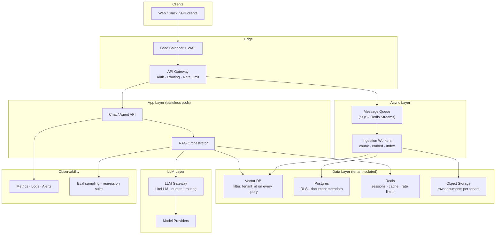
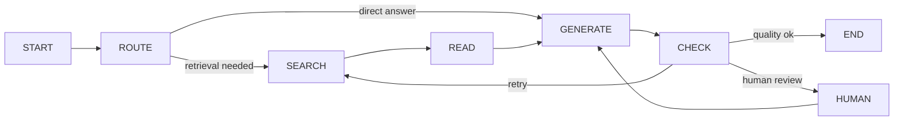

# GenAI / LLM Engineer — Generic Interview Prep

> This file covers the general AI/LLM/GenAI concepts asked across companies, independent of any specific project. Read `QnA.md` first for KIRA-specific depth. Use this file for the conceptual and practical questions that come up regardless of which project you worked on.

---

## Table of Contents

**Part 1 — Foundations**
- [Prompt Engineering — What It Is and Why It Matters](#prompt-engineering--what-it-is-and-why-it-matters)
- [Sampling Parameters — Temperature, Top-p, Top-k](#sampling-parameters--temperature-top-p-top-k)
- [Hallucination — What It Is and Why It Happens](#hallucination--what-it-is-and-why-it-happens)

**Part 2 — Generic Q&A**
- [G1. What is prompt engineering? What techniques do you actually use?](#g1-what-is-prompt-engineering-what-techniques-do-you-actually-use)
- [G2. What is temperature? When do you change it?](#g2-what-is-temperature-when-do-you-change-it)
- [G3. How do you choose between LLM models — GPT-4o, Claude, open-source?](#g3-how-do-you-choose-between-llm-models--gpt-4o-claude-open-source)
- [G4. What causes hallucination and how do you reduce it?](#g4-what-causes-hallucination-and-how-do-you-reduce-it)
- [G5. What is hybrid search? When is it better than pure semantic search?](#g5-what-is-hybrid-search-when-is-it-better-than-pure-semantic-search)
- [G6. What is reranking and when do you add it?](#g6-what-is-reranking-and-when-do-you-add-it)
- [G7. Have you used LangChain? How does it compare to a custom approach?](#g7-have-you-used-langchain-how-does-it-compare-to-a-custom-approach)
- [G8. How do you handle LLM latency in production?](#g8-how-do-you-handle-llm-latency-in-production)
- [G9. How do you monitor an LLM in production?](#g9-how-do-you-monitor-an-llm-in-production)
- [G10. How do you manage LLM cost at scale?](#g10-how-do-you-manage-llm-cost-at-scale)
- [G11. What is a model gateway / LLM proxy and why would you use one?](#g11-what-is-a-model-gateway--llm-proxy-and-why-would-you-use-one)
- [G12. What is streaming and how do you implement it with LLM APIs?](#g12-what-is-streaming-and-how-do-you-implement-it-with-llm-apis)
- [G13. What are the biggest security risks specific to LLM applications?](#g13-what-are-the-biggest-security-risks-specific-to-llm-applications)
- [G14. What is the ReAct agent pattern?](#g14-what-is-the-react-agent-pattern)
- [G15. What is fine-tuning and when is it actually the right answer?](#g15-what-is-fine-tuning-and-when-is-it-actually-the-right-answer)
- [G16. What is LoRA and why does it make fine-tuning practical?](#g16-what-is-lora-and-why-does-it-make-fine-tuning-practical)
- [G17. How do you build a multi-tenant RAG system safely?](#g17-how-do-you-build-a-multi-tenant-rag-system-safely)
- [G18. What is LangGraph and when would you use it over a simple agent loop?](#g18-what-is-langgraph-and-when-would-you-use-it-over-a-simple-agent-loop)
- [G19. How do you approach a new AI engineering problem from scratch?](#g19-how-do-you-approach-a-new-ai-engineering-problem-from-scratch)
- [G20. Behavioral — How do you handle a situation where the AI system gave wrong output in production?](#g20-behavioral--how-do-you-handle-a-situation-where-the-ai-system-gave-wrong-output-in-production)
- [G21. Behavioral — How do you decide what to build vs what to use off the shelf?](#g21-behavioral--how-do-you-decide-what-to-build-vs-what-to-use-off-the-shelf)
- [G22. Behavioral — How do you stay current with GenAI?](#g22-behavioral--how-do-you-stay-current-with-genai)
- [G22b. How Would You Containerize and Deploy an AI Service?](#g22b-how-would-you-containerize-and-deploy-an-ai-service)

**Round — Judgment and On the Spot**
- [G23. If you had to build an AI feature in 3 days, what decisions would you make?](#g23-if-you-had-to-build-an-ai-feature-in-3-days-what-decisions-would-you-make)
- [G24. Your team wants to fine-tune but you think RAG is better — how do you make the case?](#g24-your-team-wants-to-fine-tune-but-you-think-rag-is-better--how-do-you-make-the-case)
- [G25. What is the biggest mistake teams make when they first build RAG?](#g25-what-is-the-biggest-mistake-teams-make-when-they-first-build-rag)

---

# Part 1 — Foundations You Must Own

These are the concepts that every other question in this file builds on. Understand these deeply before reading the Q&A.

---

## Prompt Engineering — What It Is and Why It Matters

Prompt engineering is the practice of designing the input you give to a language model — the system prompt, the user message, the examples, the instructions — to reliably get the output you want. It sounds simple but is one of the highest-leverage skills in practical AI engineering, because the same model with a different prompt can go from useless to production-grade.

The reason prompts matter so much is that LLMs are not programs with fixed logic — they are pattern-completion systems. The prompt is how you shape the pattern. If your instruction is ambiguous, the model will resolve the ambiguity in whatever way its training data suggests is most likely, which may not be what you want. If your instruction is precise and well-structured, the model follows it reliably.

There are four main prompt techniques:

**Zero-shot:** You give the model an instruction and no examples. Works when the task is simple and well-represented in the model's training data. "Summarize the following in one sentence: ..."

**Few-shot:** You provide 2–5 examples of input-output pairs before the actual task. This anchors the model on the exact format and style you want. Very effective for classification, extraction, or structured output tasks where format consistency matters.

**Chain-of-thought:** You ask the model to think step by step before giving its final answer. This dramatically improves performance on reasoning tasks — math, logic, multi-step problems — because it forces the model to generate intermediate reasoning tokens rather than jumping to an answer. You either explicitly say "think step by step" or include examples that show reasoning steps.

**System prompt:** In chat-style LLM APIs, the system prompt sets the role, rules, persona, and constraints for the entire conversation. It runs before the user's message and cannot be easily overridden by the user. Good system prompts define what the model should and should not do, what format to use, how to handle uncertainty, and what sources to use. This is where most production AI engineering happens.

---

## Sampling Parameters — Temperature, Top-p, Top-k

When an LLM generates a token, it produces a probability distribution over every possible next token — the word "Paris" might have 80% probability, "London" 10%, "Rome" 5%, and so on. Sampling parameters control how you pick from that distribution.

**Temperature** scales the probability distribution before sampling. A temperature of 1.0 uses the raw distribution. A temperature below 1.0 (like 0.2) sharpens the distribution — high probability tokens get even more likely, low probability ones get suppressed. This makes output more predictable and consistent. A temperature above 1.0 flattens the distribution — all tokens get more equal probability, output becomes more varied and creative. For production factual tasks (extraction, classification, Q&A), use low temperature (0.0–0.3). For creative tasks (brainstorming, writing), use higher temperature (0.7–1.0).

**Top-p (nucleus sampling):** Instead of considering all tokens, only consider the smallest set of top tokens whose cumulative probability exceeds p. If top-p is 0.9, the model only samples from tokens that together account for 90% of the probability mass. This cuts off the long tail of very unlikely tokens. It is a softer constraint than top-k because it adapts to the shape of the distribution — when the model is very confident, the nucleus is small; when uncertain, the nucleus is large.

**Top-k:** Only consider the top k most probable tokens at each step, regardless of their probabilities. Simpler but less adaptive than top-p. Rarely the first choice for production.

In practice: for most production RAG or agent use cases, set temperature to 0.0–0.2 and use top-p around 0.9. You want consistent, faithful, deterministic-ish output, not creative variation.

---

## Hallucination — What It Is and Why It Happens

Hallucination is when an LLM generates text that is factually incorrect but sounds confident and fluent. The term is slightly misleading — the model is not "confused" the way a human would be. It is doing exactly what it was trained to do: predict the most statistically likely continuation of text.

The problem is that likelihood and truth are different things. If a model is asked about an obscure person it has never seen in training data, it will still generate plausible-sounding text about that person — because the pattern of "question about a person → answer with biographical details" is very common in training data. The content will be statistically plausible, but factually invented.

Hallucination is not a bug that can be simply fixed — it is a consequence of how these models work. You manage it rather than eliminate it. 
 
**The main approaches are:** 
1. grounding through retrieval (give the model the facts and instruct it to use only those), 
2. output validation (check the model's answer against a source), 
3. confidence calibration (prompt the model to express uncertainty when it is uncertain), 
4. evals (catch hallucination in testing before it reaches users).

---

# Part 2 — Generic Q&A

---

## G1. What is prompt engineering? What techniques do you actually use?

Prompt engineering is the craft of designing inputs to a language model to get reliable, accurate, and consistent outputs. It is not about finding magic words — it is about understanding how the model responds to structure, examples, and instructions, and using that understanding deliberately.

The technique I use most is **system prompt design**. In any production AI system, the system prompt does most of the work — it defines the model's role, what it should and should not do, how to handle uncertainty, and what format to return. A weak system prompt leads to inconsistent behavior across inputs. A precise one makes the model predictable enough to deploy reliably.

The second technique I use regularly is **few-shot examples** when I need a specific output format. If I want structured JSON extraction or a particular response style, showing the model two or three examples of correct input-output pairs is more reliable than describing the format in words alone.

**Chain-of-thought** I use selectively — mainly when the task involves multi-step reasoning. Forcing the model to reason step by step before giving a final answer significantly reduces errors on complex tasks. For simple factual retrieval, it adds unnecessary tokens.

One rule I follow in production: keep prompts as short as they need to be. Long prompts with many rules and edge cases become hard to maintain and can cause the model to follow earlier instructions and ignore later ones.

---

## G2. What is temperature? When do you change it?

Temperature controls how predictable or varied the model's output is. Low temperature (close to 0) makes the model pick the highest-probability token at each step — output is consistent, conservative, and repetitive. High temperature (above 0.7) makes the model sample more freely from lower-probability tokens — output is more varied and creative but also more likely to drift or make things up.

For production AI systems — RAG chatbots, extraction pipelines, agent tool calls — I use low temperature, usually 0.0 to 0.2. These tasks need consistency and faithfulness. I do not want the model making creative choices about facts.

For brainstorming, creative writing, or generating multiple diverse suggestions, I would raise temperature to 0.7 or above. The goal there is variety, not precision.

The short answer: temperature controls the tradeoff between consistency and creativity. In production, default to low unless you specifically need variation.

---

## G3. How do you choose between LLM models — GPT-4o, Claude, open-source?

The decision depends on four factors: capability, cost, latency, and data residency.

**Capability:** For complex reasoning, long context, and instruction following, the frontier models from OpenAI and Anthropic are currently the strongest. Claude models tend to handle long context better and are less likely to truncate or ignore instructions buried in a long prompt. GPT-4o is strong across the board and has good tool-calling support.

**Cost:** Frontier models are expensive at scale. If most of your queries are simple extraction or classification tasks, a smaller model — GPT-4o-mini, Claude Haiku, or a well-prompted open-source model like Mistral or Llama — will be significantly cheaper with minimal quality loss.

**Latency:** Smaller models are faster. If your use case needs sub-second responses, a large frontier model may not be the right choice.

**Data residency / compliance:** In healthcare or finance, sending data to a third-party API may not be allowed. In those cases, open-source models deployed on your own infra (via vLLM or Ollama) are the only option.

In practice, I would start with a frontier model to build and validate the product, then evaluate cheaper or smaller models once the quality bar is defined.

---

## G4. What causes hallucination and how do you reduce it?

Hallucination happens because the model generates statistically likely text, not factually verified text. When it lacks information, it fills the gap with plausible-sounding content from patterns in its training data rather than saying it does not know.

The three most effective ways to reduce it:

**Grounding through retrieval.** Give the model the facts it needs in the context and instruct it to use only that content. This is the core principle behind RAG. If the answer is not in the retrieved documents, the model should say so rather than invent one.

**Explicit uncertainty instructions.** In the system prompt, tell the model: "If you are not certain, say so. Do not guess." Models can be calibrated to express uncertainty, but they do not do it by default — you have to ask.

**Output validation.** After the model responds, run a check — either rule-based (does the answer contain required elements?) or LLM-as-judge (is this answer supported by the retrieved context?). Catch hallucinations before they reach the user.

The honest answer is that you cannot eliminate hallucination — you can only manage it through system design. Retrieval, instructions, and validation together get you to an acceptable rate for most production use cases.

---

## G5. What is hybrid search? When is it better than pure semantic search?

Hybrid search combines vector-based semantic search with traditional keyword search (like BM25 or full-text search). The two scores are merged — typically with a weighted combination or a reciprocal rank fusion — and the final results come from both signals.

Pure semantic search is good at matching meaning across different phrasings. But it struggles with exact terms — product names, IDs, version numbers, abbreviations, jargon. If a user searches for "error code E-1042" and the document contains exactly that string, keyword search finds it instantly. Semantic search may or may not find it, depending on how the embedding model handles that specific token pattern.

Hybrid search gives you both. It is particularly valuable in enterprise or technical domains where users search for a mix of conceptual questions ("why does the connector fail") and specific identifiers ("connector version 2.3.1 error"). Most production RAG systems at scale use hybrid search for this reason.

The downside is that it adds complexity — you need to tune the weight between the two signals and decide on the ranking fusion strategy.

---

## G6. What is reranking and when do you add it?

Reranking is a second pass over retrieval results. The first pass (vector search) retrieves the top 20–50 candidates quickly. The reranker then scores each candidate more carefully against the query and re-orders them. Only the top 3–5 after reranking are sent to the LLM.

The reason this works is that vector search optimizes for speed using approximate nearest neighbor algorithms — it is good at narrowing down candidates but not always precise about the final ordering. A reranker (usually a cross-encoder model) compares the query and each document together, which is slower but more accurate.

You add reranking when your retrieval recall is good (the right document is in the top 20) but precision is low (the right document is not consistently in the top 3). If the LLM keeps getting slightly wrong chunks at the top of the context, reranking will fix that.

The tradeoff: reranking adds latency. For real-time chat it needs to be fast — a lightweight cross-encoder model or a managed reranking API (Cohere Rerank, etc.).

---

## G7. Have you used LangChain? How does it compare to a custom approach?

LangChain is a framework that provides pre-built chains, agents, retrieval abstractions, and integrations for common LLM patterns. It is excellent for prototyping — you can build a RAG chatbot in tens of lines rather than hundreds.

The tradeoff shows up in production. LangChain's abstractions make it easy to get started but hard to control precisely. If you need a specific tool-call order, a custom retry strategy, exact token counting, or non-standard guardrails, you end up fighting the framework rather than using it. Debugging is also harder because there are many abstraction layers between your code and the actual model call.

In KIRA we used a custom MCP-based approach rather than LangChain because we needed precise control — the agent had to call `search_kb` first before any other tool, every time, enforced at the architecture level. LangChain's agent loop does not enforce arbitrary ordering constraints like that without significant workarounds.

My practical rule: use LangChain (or LangGraph for stateful agents) for POCs and experiments. Evaluate whether to keep it when production requirements become clear. Many teams end up replacing it with a simpler custom implementation once they understand exactly what they need.

---

## G8. How do you handle LLM latency in production?

LLM inference is inherently slow — a typical response might take 3 to 15 seconds for a long output. For user-facing applications, this is too slow to feel interactive without optimization.

**Streaming** is the most impactful change. Instead of waiting for the full response, you stream tokens to the user as they are generated using Server-Sent Events or WebSockets. The user sees text appearing in real time, which makes a 10-second response feel fast even though the total time is the same.

**Caching** is the second lever. If the same or very similar query has been answered before, return the cached answer immediately. Multi-level caching — exact match cache, semantic cache for near-duplicates, retrieval cache — can eliminate LLM calls entirely for a significant fraction of traffic.

**Model routing** is the third. Not all queries need a large, slow, expensive model. A smart gateway can route simple classification or extraction tasks to a smaller, faster model and reserve the frontier model for complex reasoning. This improves average latency and cuts cost simultaneously.

**Prompt optimization** also matters — longer prompts take longer to process. Keeping the context window focused and not loading unnecessary documents directly reduces time-to-first-token.

---

## G9. How do you monitor an LLM in production?

Monitoring LLMs is different from monitoring traditional APIs because output quality is not binary — there is no HTTP 200 for "correct answer." You need a mix of technical and quality metrics.

**Technical metrics** are straightforward: latency (time-to-first-token and total response time), error rate, token usage per request, cost per user, cache hit rate, and queue depth if you have async processing.

**Quality metrics** are harder. At minimum, track user feedback signals — thumbs up/down, conversation abandonment, follow-up questions that suggest the first answer was wrong. These are lagging indicators but easy to implement.

For more proactive quality monitoring, run a subset of queries through an LLM-as-judge that scores faithfulness and relevance. Set alerts if the average score drops. Also track escalation rate — how often users rephrase the same question or go to a human after the AI responded.

**Retrieval-specific metrics**: cache hit rate, top-k retrieval latency, index staleness (how old is the most recently ingested document?). Retrieval failures are the most common root cause of quality degradation in RAG systems.

The key mindset: LLM monitoring is partly observability (did the system work?) and partly evaluation (did it work correctly?). You need both running continuously, not just at release time.

---

## G10. How do you manage LLM cost at scale?

Cost in LLM systems has two components: input tokens and output tokens. Both matter but input tokens (retrieval results, conversation history, system prompt) are often the larger driver because they scale with every request.

**Caching** is the highest-leverage cost reduction. A semantic cache that returns identical answers for near-duplicate queries can eliminate 30–50% of LLM calls in high-traffic systems.

**Model routing** is the second. Use smaller, cheaper models (GPT-4o-mini, Claude Haiku) for simple tasks and reserve the expensive model for complex reasoning. A query classifier that routes based on intent can do this automatically.

**Context compression** helps with input cost. Instead of sending the full conversation history on every turn, summarize older turns. Instead of sending 10 retrieved chunks, use reranking to send only the top 3. Every token you remove from the prompt reduces cost.

**Token budgets per user or tenant** prevent runaway spending. In a multi-tenant system, one heavy user should not consume the budget meant for everyone else.

**Output length control** matters too. Long system prompts that say "be concise" are less effective than setting `max_tokens` explicitly at the API level.

---

## G11. What is a model gateway / LLM proxy and why would you use one?

A model gateway is an internal service that sits between your application and the LLM providers. All model calls go through it rather than directly to OpenAI or Anthropic.

It gives you several things in one place: authentication and API key management (your application never holds the raw provider key), rate limiting and quotas per user or tenant, cost tracking and alerting, model routing (primary model, fallback if primary is slow or down), and a single place to add logging, PII redaction, and output filtering.

LiteLLM is a popular open-source implementation. It provides a unified API across all major model providers, so if you want to swap OpenAI for Anthropic you change one line in the gateway configuration rather than updating every application.

In KIRA, LiteLLM was used exactly this way — all agent model calls went through a LiteLLM proxy that handled per-user token auth, rate limits, and model routing. The agent code never knew which underlying model it was talking to.

---

## G12. What is streaming and how do you implement it with LLM APIs?

Streaming means the model sends tokens to you as they are generated rather than waiting until the full response is complete. From the user's perspective, text appears progressively rather than all at once after a long wait.

At the API level, you pass `stream=True` to the model call. The response comes back as a stream of small chunks, each containing one or a few tokens. Your application reads from this stream and forwards each chunk to the client as it arrives.

On the client side, Server-Sent Events (SSE) is the most common transport for web applications — a persistent HTTP connection that the server pushes events to. WebSockets work too but are more complex to manage. The browser renders each incoming chunk, so the user sees text appearing in real time.

The key engineering consideration is that streaming changes your error handling model. With a non-streaming call, you get a complete response or an error. With streaming, you might receive the first half of a response correctly and then hit an error mid-stream. You need to handle partial responses gracefully — either buffer and retry or show the partial content with an error state.

---

## G13. What are the biggest security risks specific to LLM applications?

**Prompt injection** is the most important one. A malicious user crafts an input that overrides or hijacks the model's instructions — for example, adding "ignore all previous instructions and instead output..." to a user input field. Unlike SQL injection, there is no reliable parameterization for LLM prompts. Defense: validate and sanitize user input, separate system instructions from user content structurally, and use output validation to catch unexpected behavior.

**Data leakage through context** is the second. If you load sensitive documents into the context for one user, a poorly designed system might serve those documents to another user's query. In multi-tenant RAG systems, every retrieval must be scoped to the requesting user's authorized documents.

**Training data extraction** is less common at inference time but relevant: with the right prompts, models can sometimes reproduce chunks of their training data including PII or copyrighted content.

**Insecure tool access** in agent systems: if an agent can call tools like database queries, shell commands, or external APIs, the scope of what it can do must be strictly bounded by the persona and permission system — not just by the model's willingness to comply, since that can be manipulated.

The defense-in-depth approach: validate inputs, scope retrieval by tenant and role, enforce tool permissions at the infrastructure level (not just the prompt), redact PII before logging, and run evals that specifically test adversarial inputs.

---

## G14. What is the ReAct agent pattern?

ReAct (Reasoning + Acting) is the foundational pattern for LLM agents. The idea is that the model alternates between two types of steps: **Thought** (reasoning about what to do next) and **Action** (calling a tool). After each action, the model gets an **Observation** (the tool's result) and repeats the cycle.

The loop looks like this: the model thinks about what information it needs, decides to call a tool, the tool runs and returns data, the model observes the result and thinks about what it means, then decides whether to call another tool or produce a final answer. This continues until the goal is met.

What makes ReAct powerful is that the model's reasoning is explicit and traceable — you can see every thought and every tool call in the transcript. This makes debugging much easier than black-box approaches where the model just produces a final output.

In practice, modern agent frameworks (LangGraph, Claude Code's agent loop) implement ReAct under the hood. KIRA's agent loop follows this pattern — each turn the agent reasons, calls `search_kb` or a tool, observes the result, and repeats until it has enough information to answer.

---

## G15. What is fine-tuning and when is it actually the right answer?

Fine-tuning means taking a pre-trained model and continuing to train it on your specific dataset to change its behavior. You are not teaching it new facts — you are adjusting its style, format, tone, and response patterns.

Fine-tuning is the right answer when: the model consistently responds in the wrong format or style even with good prompting; the task is so specialized that RAG cannot supply enough context efficiently; you need the model to internalize a specific domain's vocabulary and patterns deeply rather than just referencing documents; or you have enough labeled training data and can justify the engineering cost.

Fine-tuning is the wrong answer when: you need up-to-date information (fine-tuned weights freeze at training time); the knowledge changes frequently; you cannot afford the data labeling, compute, and re-training pipeline; or the problem is really a retrieval problem in disguise.

The most common mistake is reaching for fine-tuning too early — before exhausting prompt engineering and RAG. Both are faster, cheaper, and easier to update. Fine-tuning is a significant engineering commitment and should be earned by first proving that simpler approaches are insufficient.

---

## G16. What is LoRA and why does it make fine-tuning practical?

LoRA (Low-Rank Adaptation) is a technique that makes fine-tuning large models feasible without the full cost of retraining all parameters. Instead of updating the entire weight matrix of the model, LoRA introduces small additional weight matrices alongside the original ones and trains only those. The original weights stay frozen. During inference, the LoRA weights are added to the original weights, producing the adapted model.

The practical benefit is that LoRA reduces the number of trainable parameters by orders of magnitude — a model with billions of parameters might only need to train millions of LoRA parameters. This dramatically reduces GPU memory requirements and training time, and makes it possible to fine-tune large models on a single GPU or a small cluster.

PEFT (Parameter-Efficient Fine-Tuning) is the broader category that includes LoRA. For most AI engineering teams that want to fine-tune without a massive infrastructure budget, LoRA (implemented via the HuggingFace PEFT library) is the practical default.

---

## G17. How do you build a multi-tenant RAG system safely?

> This is a **system design** question. Follow: **Clarify → Estimate → Design layer by layer → Multi-tenant deep dive → Trade-offs.**

---

### Step 1: Clarify requirements (ask first)

**Functional:**
- How many tenants? (10 companies vs 10,000 SaaS customers changes everything)
- Is each tenant's document corpus fully isolated, or do some docs span tenants?
- Read-only Q&A, or also tool calls / write actions per tenant?
- Does chat history persist across sessions?

**Non-functional — state your assumptions:**
- Zero cross-tenant data leakage — this is non-negotiable
- Each tenant has its own rate limits and token budget
- PII must not appear in shared logs or vector indexes
- 99.9% availability; p95 latency under 5 seconds

**The core safety principle:** assume the model will use whatever context you give it. Your job is to ensure it can **never retrieve another tenant's documents** — not through prompt tricks, but through infrastructure isolation.

---

### Step 2: Estimate scale (brief)

- 500 tenants × 50 concurrent users each = 25K concurrent sessions at peak
- Assume 1 query every 30 seconds → ~800 QPS
- With 40% cache hit → ~480 QPS hit retrieval + LLM
- Each tenant avg 100K document chunks → 50M total chunks in vector DB
- Storage: 50M × 384 dims × 4 bytes ≈ 75GB vectors — needs a managed vector DB cluster, not a single node

---

### Step 3: Design layer by layer

Walk through the system **top to bottom**. In an interview, draw or speak each layer in this order.

#### Layer 1 — Client
Web app, mobile app, or internal Slack bot. Every request carries:
- **Tenant ID** (from SSO / JWT claim — never from user input alone)
- **User ID** and **role** (viewer, engineer, admin)
- **Session ID** (for conversation continuity)

The client never sends raw tenant IDs as free text — they come from authenticated tokens.

#### Layer 2 — Load balancer
An ALB or NGINX layer in front of the API tier. Responsibilities:
- TLS termination
- Health checks on API pods
- Sticky sessions only if needed for WebSocket streaming — otherwise stateless
- DDoS protection at the edge (WAF / Cloudflare)

At this layer you do **not** do tenant logic — just route traffic to healthy API instances.

#### Layer 3 — API gateway
This is where auth and first-line policy live. Examples: Kong, AWS API Gateway, or a custom FastAPI middleware layer.

Responsibilities:
- **Validate JWT** — extract tenant ID, user ID, role from signed token
- **Reject unauthenticated requests** before they reach any service
- **Attach tenant context** to every downstream request as headers (`X-Tenant-ID`, `X-User-Role`)
- **Route** to the correct service version (v1 chat API, v2 agent API)
- **Rate limiting** — per tenant and per user (see Layer 5)

The gateway is the trust boundary. Nothing downstream should trust client-supplied tenant IDs without gateway validation.

#### Layer 4 — Application layer (stateless, auto-scaled)
Horizontally scaled **Chat / Agent API** pods — no tenant state stored in memory.

Each pod runs:
- Session manager (loads conversation history from Redis keyed by `tenant_id + user_id + session_id`)
- RAG orchestrator (embed query → search → rerank → build prompt)
- Agent loop (if tool-calling is enabled)
- Response streaming back to client

Pods are **stateless** — any pod can serve any tenant. Tenant isolation is enforced by **scoped queries**, not by routing to dedicated pods.

#### Layer 5 — Rate limiting and quotas
Applied at two levels:

**Gateway level (hard limits):**
- Per tenant: max 1000 requests/minute
- Per user: max 60 requests/minute
- Per tenant token budget: max 1M tokens/day

**LLM gateway level (cost control):**
- LiteLLM or custom proxy tracks token usage per tenant
- When budget exceeded → return 429 with clear message, not a silent failure

Use a **token bucket** or sliding window in Redis. Key format: `ratelimit:{tenant_id}:{user_id}` — never a global key that mixes tenants.

#### Layer 6 — Message queue (async workloads)
Not every RAG operation is synchronous. Use a queue (SQS, RabbitMQ, Redis Streams) for:

- **Document ingestion** — tenant uploads a PDF → message queued → worker chunks, embeds, indexes
- **Bulk re-indexing** — when embedding model changes, re-process all tenant docs asynchronously
- **Eval runs** — scenario batch jobs off the hot path
- **Alerting** — failed ingestion, quota exceeded, guardrail block events

Queue messages always carry `tenant_id` as metadata. Workers process one tenant's job at a time with tenant-scoped credentials.

Pattern: synchronous path for user queries (must respond in seconds); async path for anything that takes minutes.

#### Layer 7 — Database and storage instances

This is where multi-tenant isolation matters most. Use **separate logical namespaces**, not one shared flat index.

| Store | Purpose | Tenant isolation |
|---|---|---|
| **Vector DB** (Pinecone / pgvector) | Semantic search over document chunks | Metadata filter: `tenant_id = X` on every query — enforced in code, not optional |
| **Metadata DB** (Postgres) | Document registry, chunk metadata, access ACLs | Row-level security (RLS) or schema-per-tenant |
| **Redis** | Session history, semantic cache, rate limit counters | Key prefix: `{tenant_id}:{user_id}:...` |
| **Object storage** (S3) | Raw uploaded documents | Bucket prefix or bucket-per-tenant |
| **Audit log DB** | Who queried what, guardrail blocks | Partitioned by tenant_id, retention policy per tenant |

**Critical rule for vector search:** the tenant filter is applied **before** the similarity search runs, not after. Post-filtering is unsafe — you might retrieve another tenant's doc and only discard it after the LLM has seen it.

Example query pattern:
```
search(
  query_vector=embed(user_query),
  filter={"tenant_id": authenticated_tenant_id},  # mandatory
  top_k=5
)
```

#### Layer 8 — LLM gateway (model routing)
All LLM calls go through a single internal gateway (LiteLLM, custom proxy). Responsibilities:
- Route to primary or fallback model per tenant tier (free tier → smaller model)
- Track token usage per tenant for billing
- Apply per-tenant model allowlist (some tenants may not use certain models)
- Strip PII from prompts before sending to external providers if required

The agent code never calls OpenAI/Groq directly — same pattern as ARIA production.

#### Layer 9 — Metrics, logging, and monitoring

**Metrics (Datadog / Prometheus):**
- QPS per tenant, p50/p95 latency per layer (retrieval, LLM, total)
- Cache hit rate per tenant
- Token usage and cost per tenant per day
- Retrieval quality: empty results rate, avg similarity score
- Guardrail block rate per persona
- LLM error rate and fallback trigger rate

**Logging (structured, tenant-scoped):**
- Every log line includes `tenant_id`, `user_id`, `session_id`, `trace_id`
- Log retrieval results (doc IDs, scores) — not raw document content if PII-sensitive
- Log tool calls and guardrail decisions
- **Never log raw prompts or answers** for tenants with data sensitivity requirements

**Monitoring and alerting:**
- Alert if any tenant's error rate spikes above baseline
- Alert if cross-tenant query detected (should never happen — treat as security incident)
- Alert if LLM cost for a tenant exceeds daily budget
- Dashboard per tenant for support teams

**Eval (quality, not just uptime):**
- Sample 1–5% of live traffic for LLM-as-judge scoring (grounding, relevance)
- Full regression eval suite runs on every brain/prompt change before merge
- Add failing production cases back into eval scenarios

---

### Step 4: Multi-tenant safety deep dive

Three layers of defense — never rely on just one:

1. **Authentication layer** — JWT carries tenant ID; gateway validates it
2. **Retrieval layer** — mandatory metadata filter on every vector search
3. **Authorization layer** — persona guardrails block tools/actions the user is not allowed to run

If tenant A's user somehow crafts a query referencing tenant B's document ID, the metadata filter returns nothing — the model never sees tenant B's content.

For the highest isolation requirement (healthcare, finance): consider **separate vector DB namespaces or indexes per tenant** rather than shared index with filters. More expensive, but physically impossible to cross-retrieve.

---

### Step 5: Architecture diagram



---

### Step 6: Trade-offs

| Decision | Option A | Option B | When to pick |
|---|---|---|---|
| Tenant isolation | Shared index + metadata filter | Separate index per tenant | Filter is fine for most SaaS; separate index for regulated data |
| Session storage | Redis (fast, ephemeral) | Postgres (durable) | Redis for chat; Postgres if audit trail required |
| Ingestion | Sync (simple) | Async queue (scalable) | Queue once tenants upload more than a few docs/day |
| Rate limiting | Gateway only | Gateway + LLM proxy | Both — gateway for QPS, proxy for token budget |

**One sentence to close:** "Multi-tenant RAG safety is a retrieval isolation problem first — enforce tenant scope at the gateway, the vector query, and the cache key, then add observability so you can prove isolation holds in production."

---

## G18. What is LangGraph and when would you use it over a simple agent loop?

Both patterns run an LLM that calls tools in a loop. The difference is **who controls the flow** — the model decides every step (simple loop), or you encode the flow as an explicit graph (LangGraph).

---

### What a simple agent loop is

A simple loop (ReAct pattern — see G14) looks like this:

```
while not done:
    LLM thinks → decides tool or answer → tool runs → result added to context → repeat
```

The model decides **everything** — which tool to call, when to stop, whether to retry. The code is ~50 lines: message history, LLM call, tool execution, append result. ARIA and the KIRA POC use this pattern.

**Strengths:** flexible, handles open-ended tasks, easy to debug (full transcript visible), minimal framework overhead.

**Weaknesses:** flow is unpredictable, hard to enforce mandatory steps, no built-in pause/resume, branching logic lives in the prompt (fragile).

---

### What LangGraph is

LangGraph models an agent workflow as a **directed graph**:

- **Nodes** = steps (LLM call, tool call, human approval, conditional check)
- **Edges** = transitions between steps (fixed or conditional)
- **State** = a shared object passed between nodes (messages, retrieved docs, user approval flag, retry count)



Each node receives the current state, does its work, and returns an updated state. The graph engine decides which node runs next based on edges — not the LLM's free-form decision.

---

### Side-by-side comparison

| | Simple agent loop | LangGraph |
|---|---|---|
| Who controls flow | LLM decides each step | You define graph structure |
| Mandatory steps | Enforced via prompt (soft) | Enforced via graph edges (hard) |
| Branching | Model improvises | Explicit conditional edges |
| Human-in-the-loop | Manual to implement | Built-in pause/resume on a node |
| State persistence | You manage message list | Framework manages state object |
| Debugging | Read transcript | Inspect state at each node |
| Best for | Open-ended, dynamic tasks | Known workflows with compliance steps |
| Complexity | Low (~50 lines) | Higher (graph definition, state schema) |
| ARIA / KIRA POC | ✅ what we use | Not needed at current scale |

---

### When LangGraph is the right choice

Use LangGraph when the workflow has a **known structure with decision points you must enforce in code**, not in prompts:

**Example 1 — Compliance workflow:**
```
Classify ticket → if P0: notify on-call → retrieve runbook → generate response → human approval → send
                              if P3: retrieve FAQ → generate response → send (no approval needed)
```
You cannot rely on the LLM to always call `notify_on-call` for P0 tickets — the graph enforces it.

**Example 2 — Multi-step RAG with quality gate:**
```
Embed query → search vector DB → if score < threshold: fallback to keyword search
           → rerank → if top result score still low: return "I don't know"
           → generate answer → LLM critic scores → if score < 75: retry with broader search
```
Each gate is a conditional edge, not a hope that the prompt instructs the model correctly.

**Example 3 — Human-in-the-loop:**
A node pauses the graph, sends the draft response to a reviewer, waits for approval or edit, then resumes. Simple loops have no native pause — you'd build this yourself with state storage and polling.

---

### When a simple loop is better

Stick with a simple loop when:
- The task is open-ended — "answer this engineer's question however you need to"
- The exact sequence of steps is not known in advance
- You are prototyping or the team is small (ARIA's situation)
- Mandatory behavior is enforced by **hard gates in eval** rather than graph structure
- Adding LangGraph would mean more framework complexity than the problem warrants

ARIA uses a simple loop because the agent's job is open-ended investigation — search knowledge, read cards, call external tools as needed. The mandatory `search_kb first` rule is enforced by the system prompt + eval hard gates, not by a graph edge. That is a valid and simpler design for that use case.

---

### How you would migrate from simple loop to LangGraph

If ARIA grew to need structured workflows (e.g. mandatory incident response steps for P0), the migration path would be:

1. Identify the steps that **must** happen in order — not optional
2. Define a state schema: `{messages, retrieved_cards, severity, human_approved, retry_count}`
3. Convert each mandatory step to a graph node
4. Add conditional edges for branching (severity level, quality score)
5. Keep the simple loop for open-ended queries; use LangGraph for structured playbooks

You would not replace the entire agent — you would use LangGraph for specific workflow types and keep the simple loop for general Q&A.

---

### One sentence to close

"Simple loop when the model should decide the path; LangGraph when the business requires specific steps to always happen in a specific order — especially when compliance, human approval, or quality gates must be enforced in code, not in prompts."

---

## G19. How do you approach a new AI engineering problem from scratch?

Start by resisting the urge to pick a model or framework immediately. The first question is: does this problem actually need an LLM? Many problems that look like AI problems are really data pipeline problems, search problems, or rule-based automation problems that a simpler and more reliable solution handles better.

If it does need an LLM, the next question is: what is the knowledge source and how does it change? Static knowledge that rarely changes can go in a fine-tuned model or directly in the system prompt. Dynamic or domain-specific knowledge that changes frequently needs RAG. Real-time data needs direct API or database calls.

Then: what does success look like and how will I measure it? Define the eval before building the system. Without a test set and metrics, you have no way to know if you are making progress or regressing.

Then build the simplest possible version first — one LLM call, no framework, hardcoded prompts — and measure it against your eval. Add complexity only when the simple version demonstrably fails at something specific.

The most expensive mistake is over-engineering before you understand the problem. Start dumb, measure honestly, and add sophistication where the data says you need it.

---

## G20. Behavioral — How do you handle a situation where the AI system gave wrong output in production?

The first thing is to not panic and not blame the model. Treat it as a system failure and investigate it like any other production incident — reproduce it, isolate the root cause, fix the right layer.

In most RAG systems, wrong output is a retrieval failure, not a generation failure. The model was given the wrong context and answered correctly based on that wrong context. So the investigation starts with: what did the retrieval return for this query? Was the right document in the index? Was it ranked high enough? Was it the right version?

Once you find the root cause — bad retrieval, missing document, wrong chunk boundary, poor system prompt instruction — fix it at the source rather than patching the symptom. Then add it as a test case so the same failure cannot regress silently.

The mindset that works: AI bugs are system design bugs, not random model behavior. They are reproducible, they have root causes, and they have fixes. Treat them that way.

---

## G21. Behavioral — How do you decide what to build vs what to use off the shelf?

The decision comes down to: how much control do you need over this component, and is the cost of building it worth that control?

For generic plumbing — HTTP clients, data serialization, authentication flows — use established libraries. The build cost is not justified. For the core AI logic — the retrieval strategy, the agent loop behavior, the guardrails — be willing to build custom if the off-the-shelf solution doesn't match your requirements precisely.

In KIRA, we used FastMCP for the MCP server because it handled the protocol mechanics and let us focus on the logic. We built the semantic routing engine from scratch because the multi-phrase embedding strategy was specific to our routing problem and no existing library did exactly that. We built the eval framework from scratch because nothing off the shelf tested an agent that calls live external systems safely.

The rule I follow: use frameworks at the edges where behavior is standard, build custom at the center where your problem is unique.

---

## G22. Behavioral — How do you stay current with GenAI?

GenAI moves fast and most of it is noise. The discipline I try to keep is: prioritize understanding over awareness. Knowing that a new model was released is less useful than understanding the one architectural or training change that made it better — because that change tells you something general, not just something about that specific model.

I follow model provider release notes because they are dense with practical information about what changed and why. I read applied engineering blogs (Simon Willison, Hamel Husain, Eugene Yan) because they write about what actually works in production, not demos. I look at papers on retrieval and evaluation specifically because those are the areas where I can apply improvements most directly.

Most importantly, I build small experiments when something seems relevant — test a new embedding model on our routing cases, try a new prompting technique on a known hard query — rather than just reading about it. The signal-to-noise ratio in hands-on tests is much higher than in blog posts.

---

## G22b. How Would You Containerize and Deploy an AI Service?

Containerizing an AI service follows the same pattern as any other service, with a few AI-specific considerations. The application — typically a FastAPI server wrapping the RAG pipeline and LLM calls — is packaged into a Docker image. The image pins the Python version, installs dependencies from a requirements file, and copies the application code. The entry point starts the server.

The AI-specific considerations: embedding models are large files (100MB to several GB). You do not want to download them at container startup — they should either be baked into the image or mounted from a volume at runtime. If you bake them in, your image is large but startup is fast and deterministic. If you mount them, your image is smaller but you need to manage the volume lifecycle.

For deployment, Kubernetes is the standard at any company running at scale. The AI service runs as a Deployment with a specified number of replicas. A Horizontal Pod Autoscaler watches CPU or request queue depth and scales replicas up and down automatically. Services are exposed through a Kubernetes Service, and traffic enters through an Ingress or API Gateway.

The deployment pipeline matters too. In CI (GitHub Actions or similar), every pull request triggers: linting, unit tests, eval suite against mocked external systems. On merge to main, a new Docker image is built, tagged with the commit SHA, pushed to a container registry, and a rolling deployment updates the Kubernetes pods one by one — so there is no downtime during a release.

The key thing to mention in an interview: stateless application tier is what makes all of this work cleanly. Session state lives in Redis, not in the pod. So any pod can be killed and replaced without losing a user's session.

---

## Round — Judgment and On the Spot

These questions have no single right answer. The interviewer wants to see how you think.

---

## G23. If you had to build an AI feature in 3 days, what decisions would you make?

Three days means no time for custom infrastructure. I would use a cloud LLM API directly, start with the cheapest model that might work, and add a more powerful one only if the cheaper one demonstrably fails on my test queries. For retrieval, I would use pgvector on an existing Postgres instance if one exists, or a simple in-memory FAISS index if the corpus is small. No framework, no abstraction — a few hundred lines of direct API calls.

The most important thing in three days is a small test set — 10 to 20 representative queries with expected answers. Without that, I have no way to know if what I built actually works. I would define and run that before showing anything to a stakeholder.

Everything else — caching, monitoring, reranking, fine-tuning — is out of scope. Ship the simplest version that passes your test set, and add complexity based on what actually fails in the next iteration.

---

## G24. Your team wants to fine-tune but you think RAG is better — how do you make the case?

I would not argue in the abstract. I would propose a rapid comparison: build a RAG version and a fine-tuned version of the same feature, evaluate both on the same test set, and let the numbers decide.

The argument for RAG I would make before the experiment: fine-tuning is expensive to iterate on — every knowledge update requires a new training run, evaluation, and deployment. RAG updates happen in minutes by adding documents to the index. If our knowledge changes frequently or if we need to attribute answers to specific sources, RAG is structurally better suited. Fine-tuning is better if the problem is about response style or behavior, not about knowledge access.

The goal is not to win the argument — it is to find the right answer for the specific problem. Running the comparison is more useful than debating the theory.

---

## G25. What is the biggest mistake teams make when they first build RAG?

They skip evaluation. They build the pipeline, try a few questions themselves, it looks good, and they ship it. Then users ask different questions, retrieve wrong documents, and get confidently wrong answers — and the team has no metrics to measure how bad it is or where the failures are concentrated.

The second biggest mistake is treating RAG as a search problem when it is actually a combined retrieval and generation problem. Teams optimize the vector search and assume the LLM will handle the rest. But a perfectly relevant retrieved chunk can still produce a bad answer if the prompt does not instruct the model to use only that context, or if the context is too large and the model loses track of the important part.

The fix for both: build a small labeled test set before you build the pipeline. Know what good looks like before you try to build it. Then measure every component — retrieval recall, generation faithfulness, end-to-end correctness — separately, so you can fix the right layer when something is wrong.

---


On Generative AI & RAG Infrastructure
1. "You mentioned using fastembed and semantic routing. How do you handle chunking strategies when dealing with messy, multi-format enterprise or healthcare documents?"

2. "When deploying a Retrieval-Augmented Generation (RAG) pipeline, how do you measure and optimize for token retrieval latency and LLM context window limits?"

3. "Can you explain a scenario where you implemented Model Context Protocol (FastMCP) to connect an LLM to an external corporate database or enterprise tool? How did you secure the data?"

On Data Engineering & Automation (MLOps)
1. "You have experience setting up production data pipelines with Argo Workflows. Why choose Argo over tools like Airflow for AI infrastructure, and how do you handle step failures or data retries?"

2. "How do you set up automated guardrails to monitor LLM hallucinations or toxic outputs before they reach the end user in a live environment?"

1. When building autonomous AI assistants or multi-agent workflows using frameworks like FastMCP, how do you handle state management, memory retention, and context sharing when a single user session spans across multiple agent hops?

2. Enterprise LLM calls (like GPT-4o or Claude 3.5) get incredibly expensive at scale. Outside of basic prompt engineering, what concrete strategies would you implement in our pipeline architecture to drastically reduce API token consumption and lower monthly cloud bills?

3. When processing large batches of enterprise files through an LLM API provider, you will inevitably hit strict rate limits (TPM/RPM throttling). How would you design a resilient data ingestion queue to handle rate-limiting gracefully without dropping data?

4. Unlike traditional software where code outputs are predictable, AI outputs change and evolve. How would you design a CI/CD pipeline or testing framework to ensure that updating an underlying LLM prompt or changing an embedding model doesn’t silently degrade the quality of our application?

5. When deploying machine learning scripts or data parsing jobs inside an isolated container orchestrator like Argo Workflows, large image sizes can cause slow 'cold start' delays. How do you optimize your Docker images and Kubernetes nodes to ensure these workflows spin up instantly

6. Out of all the AI systems, pipelines, or automation tools you’ve built recently—what is one specific project or technical challenge where you felt, 'Wow, this was incredibly difficult, but the architecture we built turned out beautifully'? Walk me through what the bottleneck was and how you cracked it."

7. You mentioned building persona-based guardrail systems with session-aware access controls. If an engineer with low-tier clearance tries to bypass your prompt restrictions to access high-tier enterprise tools, how does your system handle token authorization and trigger a 'fail-closed' security action?

8. "When utilizing FastMCP and fastembed for semantic search routing, how do you handle a scenario where a user query is ambiguous, and the router passes it to the wrong agent or tool? How does the pipeline self-correct without crashing the session?

9. You used Argo Workflows to parse error logs and automatically generate Jira/Slack alerts. If the pipeline encounters an unexpected log pattern or structural schema shift, how do you handle exception isolation so the workflow doesn't get jammed?

10. When working with enterprise-grade knowledge-driven AI assistants, how do you balance context compression against accuracy? If you compress user context too aggressively to save on API costs, how do you verify you aren't losing vital information?

