# KIRA - Complete System Understanding

> Read this section first and understand it deeply. Once you understand the full picture, the individual interview questions become easy to answer from memory — because they are all just parts of this one story.

---

## Table of Contents

**Overview — KIRA System**
- [1. What Problem KIRA Solves](#1-what-problem-KIRA-solves)
- [2. KIRA End-to-End Flow](#2-KIRA-end-to-end-flow)
- [3. Component-by-Component Explanation](#3-component-by-component-explanation)
  - [3.1 The Knowledge Brain (Local Files)](#31-the-knowledge-brain-local-files)
  - [3.2 Semantic Routing (The RAG Layer)](#32-semantic-routing-the-rag-layer)
  - [3.3 The MCP Server (KIRA-brain)](#33-the-mcp-server-KIRA-brain)
  - [3.4 Session Management and Persona Guardrails](#34-session-management-and-persona-guardrails)
  - [3.5 Pre-Tool Authorization (Guardrails)](#35-pre-tool-authorization-guardrails)
  - [3.6 Eval Framework (Quality Assurance)](#36-eval-framework-quality-assurance)
  - [3.7 Sub-Agent Delegation](#37-sub-agent-delegation)
- [4. Key Design Decisions and Why](#4-key-design-decisions-and-why)
- [5. What You Built Specifically](#5-what-you-built-specifically)
- [6. How to Talk About KIRA in an Interview](#6-how-to-talk-about-KIRA-in-an-interview)

**Round 1 — Introduction**
- [Q1. Tell Me About Yourself](#q1-tell-me-about-yourself)
- [Q2. What Was Your Role — What Did You Own on KIRA?](#q2-what-was-your-role--what-did-you-own-on-KIRA)
- [Q3. Hardest Technical Problem You Solved](#q3-hardest-technical-problem-you-solved)
- [Q4. Why Are You Leaving CitiusTech?](#q4-why-are-you-leaving-citiustech)

**Round 2 — Core Technical**

*Foundations:*
- [F1. What Is a Token?](#f1-what-is-a-token)
- [F2. What Is a Context Window and Why Is It a Constraint?](#f2-what-is-a-context-window-and-why-is-it-a-constraint)
- [F3. What Is an Embedding / Vector?](#f3-what-is-an-embedding--vector)
- [F4. What Is Cosine Similarity — and Why Not Just Use Distance?](#f4-what-is-cosine-similarity--and-why-not-just-use-distance)
- [F5. How Do LLMs Work — The Core Intuition](#f5-how-do-llms-work--the-core-intuition)
- [F6. What Is the Attention Mechanism — Why Does It Matter?](#f6-what-is-the-attention-mechanism--why-does-it-matter)

*Questions:*
- [Q5. Explain RAG — How Does It Work and When Would You NOT Use It?](#q5-explain-rag--how-does-it-work-and-when-would-you-not-use-it)
- [Q6. How Did You Implement Semantic Search? Why MiniLM?](#q6-how-did-you-implement-semantic-search-why-minilm)
- [Q7. What is MCP and How Did You Use FastMCP?](#q7-what-is-mcp-and-how-did-you-use-fastmcp)
- [Q8. Chunking Strategy in RAG — What Chunk Size and Why?](#q8-chunking-strategy-in-rag--what-chunk-size-and-why)
- [Q9. What Are Guardrails? How Did You Implement Yours?](#q9-what-are-guardrails-how-did-you-implement-yours)
- [Q10. How Do You Evaluate a RAG Pipeline?](#q10-how-do-you-evaluate-a-rag-pipeline)
- [Q10a. How Did You Build the Eval Framework for KIRA? (Deep Dive)](#q10a-how-did-you-build-the-eval-framework-for-KIRA-deep-dive)
- [Q11. Fine-Tuning vs RAG — When to Use Which?](#q11-fine-tuning-vs-rag--when-to-use-which)
- [Q12. Vector Similarity Search — FAISS vs Pinecone vs pgvector](#q12-vector-similarity-search--faiss-vs-pinecone-vs-pgvector-and-what-we-used)

**Round 3 — Cloud & Backend**
- [Q13. How Did You Use AWS S3, RDS, EKS Together in Your ETL Pipeline?](#q13-how-did-you-use-aws-s3-rds-eks-together-in-your-etl-pipeline)
- [Q14. Explain Your Argo Workflows Pipeline Architecture](#q14-explain-your-argo-workflows-pipeline-architecture)
- [Q15. How Do You Secure an LLM API Endpoint in Production?](#q15-how-do-you-secure-an-llm-api-endpoint-in-production)

**Round 4 — System Design**
- [Q16. System Design — RAG Chatbot for 10,000 Concurrent Users](#q16-system-design--rag-chatbot-for-10000-concurrent-users)
- [Q17. System Design — Scale an AI Platform to 250,000 Users](#q17-system-design--scale-an-ai-platform-to-250000-users)
- [Q18. How Would You Build an Agentic Workflow System With Tool Calling?](#q18-how-would-you-build-an-agentic-workflow-system-with-tool-calling)
- [Q19. How KIRA Session Is Tracked](#q19-how-KIRA-session-is-tracked)

**Round 5 — Behavioral**
- [Q19. AI Output Was Wrong in Production — How Did You Handle It?](#q19-ai-output-was-wrong-in-production--how-did-you-handle-it)
- [Q20. How Do You Stay Current With GenAI?](#q20-how-do-you-stay-current-with-genai)

---

## 1. What Problem KIRA Solves

KIRA is an **internal AI assistant** built for engineers and analysts working on a large healthcare data platform. The platform had hundreds of internal systems — data pipelines, Kubernetes jobs, Jira tickets, runbooks, AWS infrastructure — and engineers spent a lot of time figuring out how to debug issues, run operations, or understand what broke and why.

The problem was not a lack of documentation. The problem was that documentation was spread across hundreds of markdown files, playbooks, SOPs, and wiki pages. Finding the right piece of information for a specific problem was slow and often required knowing exactly where to look.

KIRA solved this by making an AI agent that could **understand a user's question semantically, retrieve the right internal knowledge automatically, and then act on that knowledge using real tools** — without the engineer having to know which file to open or which script to run.

The key constraint was that KIRA runs **locally on each engineer's machine**, not as a cloud SaaS. This shaped almost every technical decision — the knowledge is a local file, the embedding model runs offline, the MCP server is a local process. This keeps it fast, private, and easy to update via git pull.

---

## 2. KIRA End-to-End Flow

Understanding this flow is the foundation. Every technical question about KIRA is about one specific part of this flow.

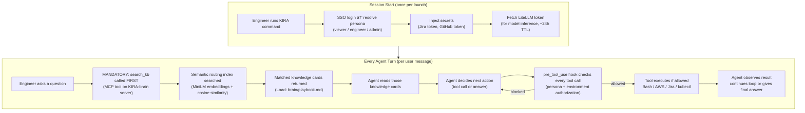

**The non-negotiable rule:** The agent must call `search_kb` before anything else. This is enforced in the system prompt and validated in evals. The reason is simple — without retrieving relevant knowledge first, the LLM answers from general training data, which is wrong for domain-specific internal systems.

---

## 3. Component-by-Component Explanation

### 3.1 The Knowledge Brain (Local Files)

The knowledge brain is a collection of **markdown files** organized into three categories:

- **Knowledge cards** — domain-specific facts, patterns, and reference docs (e.g., how a specific data pipeline works)
- **Playbooks / SOPs** — step-by-step procedures for recurring operations (e.g., how to run a monthly data refresh)
- **Workflow modules** — guides for complex multi-step tasks (e.g., connector promotion, CM upgrade)

These files live in the `brain/` directory of the git repository. Engineers update them via pull requests. The LLM never edits them directly. This makes the knowledge base **version-controlled, reviewable, and auditable**.

The brain is always local — the agent reads these files using the Read tool after routing tells it which files are relevant.

### 3.2 Semantic Routing (The RAG Layer)

This is the core retrieval mechanism. KIRA does not do traditional document chunking over PDFs. Instead, it has a **routing table** — a markdown file (`routing.md`) where each row is:

- **Trigger** — natural language phrases that describe when to use a knowledge card
- **Action** — which file(s) to load

The routing table is parsed, and each trigger phrase is converted into a vector embedding using **MiniLM** (`all-MiniLM-L6-v2`) via `fastembed`. These vectors are stored in a local JSON file called `routing-index.json`.

**Why MiniLM and not a larger model?**
MiniLM is a 384-dimension sentence embedding model. It is small (~100MB), runs entirely on CPU, works offline, and is fast enough for interactive use. At the scale of hundreds of routing entries (not millions of document chunks), brute-force cosine similarity over in-memory NumPy arrays is sufficient. There is no need for a vector database like Pinecone or FAISS.

**The multi-phrase problem and solution:**
Routing triggers were long: *"deploy connector, validate DFP, create PR, connector install."* But engineers searched with short queries: *"deploy connector."* A single embedding of the full long trigger scored poorly against a short query.

The solution was to embed each trigger in multiple ways:
1. The full trigger string as one vector
2. Each individual phrase (split by comma/dash) as separate vectors

At search time, the score for an entry is the **maximum cosine similarity across all its phrase vectors**. This means a short query like "deploy connector" matches directly against the "deploy connector" phrase vector — not competing against a long averaged embedding.

**How cosine similarity is computed:**
Both the query vector and all indexed vectors are normalized to unit length. The similarity score is simply their dot product — a number between 0 and 1 where values closer to 1 mean more similar meaning. Results below a threshold of 0.44 are filtered out to avoid returning irrelevant cards.

**Multi-keyword search:**
Engineers pass multiple keyword phrases to `search_kb`, not one long string. Each phrase is embedded independently. For each routing entry, the best score across all query keywords is kept. This improves recall when a question touches multiple topics.

### 3.3 The MCP Server (KIRA-brain)

The semantic routing engine is exposed to the AI agent as an **MCP tool** called `search_kb`. MCP (Model Context Protocol) is an open standard for connecting AI agents to external tools and data sources through a consistent interface.

The MCP server is a local Python process (`brain/mcp/mcp_server.py`) built with **FastMCP**. FastMCP is a Python framework that lets you expose functions as MCP tools with minimal boilerplate — you write a Python function, decorate it with `@mcp.tool()`, and FastMCP handles the schema generation, request routing, and stdio transport.

The server runs over **stdio transport** — Claude Code spawns it as a child process and communicates via stdin/stdout. This is the standard local MCP pattern.

What `search_kb` does internally:
1. Load or refresh the routing index from disk (checks file modification time)
2. Load the MiniLM embedding model (lazy-loaded, cached in memory after first call)
3. Embed each query phrase
4. Run cosine similarity against all indexed phrase vectors
5. Take max score per routing entry, filter by threshold
6. Apply session-aware deduplication — don't return cards already returned in this session
7. Return formatted results: which files to load

The MCP server does **not** call Jira or AWS. Those are separate integrations. The KIRA-brain server is purely for knowledge routing.

The index is refreshed automatically: when `routing.md` changes on disk (detected by file modification time), the next `search_kb` call rebuilds the index in memory and saves it atomically using a temp file + rename swap. This means engineers can update routing rules, pull changes, and get updated routing on the next query without restarting KIRA.

### 3.4 Session Management and Persona Guardrails

When KIRA launches, a `session_start` hook runs. This hook:
1. Reads the AWS SSO configuration to determine who the user is
2. Maps their SSO permission set (e.g., `arc-role-KIRA-engineers`) to a **persona** (e.g., `engineer`)
3. Determines the current **environment** (dev, staging, production) from the AWS account
4. Writes this state to a local file at `~/.KIRA/state/{session_id}.json`

The session is identified by Claude Code's `session_id` — a unique identifier per chat session. This allows multiple KIRA sessions to run concurrently on the same machine without interfering with each other.

The state file stores three things: persona name, environment name, and user identity. It does not store tokens or secrets.

**Why files and not environment variables?**
Hook subprocesses (like `pre_tool_use`) do not reliably inherit environment variables set by `session_start`. File-based sharing is the only mechanism that works consistently across all Claude Code hook types.

**Session cleanup:** Old state files (older than 24 hours) are swept on the next `session_start`. This handles crashes and forced exits where the session never cleaned up properly.

**Two separate auth tokens:**
- **LiteLLM token** — fetched once at launch from an internal bot API, has a ~24-hour TTL. Used for all LLM inference calls. If it expires during a session, the next LLM call fails with 401 and the user must restart KIRA.
- **AWS SSO credentials** — stored separately in `~/.aws/sso/cache/` with their own expiry. Used for AWS CLI, kubectl, Redshift, etc. If expired, the user runs `aws sso login` and KIRA can re-resolve persona on the next tool call.

These are independent. One expiring does not affect the other.

### 3.5 Pre-Tool Authorization (Guardrails)

Before every tool call, a `pre_tool_use` hook runs. This hook reads the session state file, loads the persona profile, and runs a 7-step authorization chain:

1. Check if the environment is allowed for this persona (e.g., `viewer` can only access `dev`)
2. Check if the tool is in the persona's deny list
3. Check if the tool is in the persona's allow list (if a list exists)
4. For Bash commands: check deny patterns (e.g., block `rm -rf`, `terraform destroy`)
5. For Bash commands: check allow patterns if defined
6. Check bulk operation limits (prevent mass writes in one session)
7. For production environments: require explicit user confirmation before write actions

The hook returns one of three decisions:
- `allow` — tool executes immediately
- `block` — tool is denied with a reason shown to the user
- `ask` — agent pauses and asks the user for explicit confirmation (used for production write actions)

This is not prompt-based safety. It is **code-enforced policy** that runs as a separate process before the tool executes. The LLM cannot bypass it by being clever with its output.

Personas range from `viewer` (read-only, dev only) to `admin` (all tools, all environments). Each persona has a profile YAML file defining exactly which tools and commands are allowed.

### 3.6 Eval Framework (Quality Assurance)

Since KIRA calls real systems (Jira, AWS, internal databases), testing it against production on every change is not safe. The eval framework solves this.

It runs KIRA as a real agent process against a **fully mocked environment**. All external calls — AWS, GitHub, Jira, kubectl — are intercepted by a local proxy (mitmproxy) that returns pre-recorded fixture responses. The agent never touches real systems during an eval.

Each eval scenario is a YAML file defining:
- The user prompt to send
- Mock responses for every expected external call
- Expected root cause (for investigation scenarios)
- Required knowledge cards that must be loaded

After the run, an automated critic evaluates:
- **Hard gates** — did `search_kb` fire first? were the required cards loaded and read?
- **LLM-as-judge** — did the agent reach the correct root cause? was the resolution actionable?
- **Mock awareness** — did the agent accidentally reveal it was in a test environment?

The pass threshold is 80/100. Runs below this are flagged as regressions.

This lets the team update the knowledge brain, add new routing rules, or change agent behavior — and immediately verify that the agent still works correctly on all existing scenarios before merging.

### 3.7 Sub-Agent Delegation

For complex investigations that span multiple domains (e.g., check logs AND query the database AND look at a Jira ticket), the main agent can delegate to sub-agents using Claude Code's Agent tool.

The key design rule for sub-agents is **pre-loading context**. Without this, each sub-agent would independently call `search_kb` and load the same knowledge cards the main agent already loaded — wasting tokens and adding latency. Instead, the main agent includes already-loaded knowledge directly in the sub-agent prompt.

Sub-agents also get their own isolated `search_kb` dedup bucket. The MCP server tracks which cards have been returned per scope (parent vs sub-agent). This prevents sub-agents from being blocked by cards the parent already loaded, while still deduplicating within each agent's own session.

---

## 4. Key Design Decisions and Why

| Decision | Why |
|----------|-----|
| **Local-first brain** | Fast, offline, version-controlled via git, no central server to maintain |
| **MiniLM over larger models** | Small enough for CPU, fast enough for interactive use, accurate enough for hundreds of entries |
| **Multi-phrase embedding** | Solves the short-query vs long-trigger mismatch — core retrieval accuracy improvement |
| **Routing over chunking** | Curated triggers are more controllable and debuggable than arbitrary document chunks |
| **MCP over direct function calls** | Standard protocol, modular tool servers, easy to add/remove integrations |
| **File-based session state** | Hook subprocesses cannot inherit env vars — files are the only reliable sharing mechanism |
| **Code-enforced guardrails** | Prompt-based safety can be bypassed by the model; hook-based policy cannot |
| **Eval harness with mocks** | Test agent behavior safely without touching production systems |
| **search_kb must be first** | Prevents the model from answering from general knowledge when domain-specific knowledge exists |
| **Atomic index saves** | Write to temp file, then rename — prevents reading a half-written corrupt index |
| **Session dedup for cards** | Prevents the same knowledge card from being returned multiple times in one session, saving tokens |

---

## 5. What You Built Specifically

Within KIRA, the parts most relevant to your engineering contribution:

- **Semantic routing implementation** — the multi-phrase embedding logic, cosine similarity search, threshold filtering, multi-keyword merge (all in `routing_core.py`)
- **MCP server** — the FastMCP-based `KIRA-brain` server exposing `search_kb`, lazy model loading, index refresh logic, session dedup
- **Guardrails layer** — pre-tool authorization hook, persona profiles, environment checks, confirmation gates
- **Eval framework** — mock proxy, scenario YAML structure, LLM critic scoring, regression test pipeline
- **Knowledge architecture** — routing table design, knowledge card structure, how brain updates flow through PRs

---

## 6. How to Talk About KIRA in an Interview

The mental model that works: **KIRA is a grounded, governed agent.**

- **Grounded** — it retrieves relevant domain knowledge before acting, so answers are based on real internal facts, not general LLM knowledge
- **Governed** — every action is checked against role-based policy before execution, so the agent cannot do more than the user is authorized to do

Almost every technical question about KIRA can be answered by explaining one part of the flow above and why that part was designed the way it was.

---

---

## Q1. Tell Me About Yourself

**Say this:**

"I'm a Software Engineer with 2.6 years of experience, currently at CitiusTech where I work on enterprise AI systems.

My core focus is GenAI — specifically RAG pipelines, semantic search, LLM orchestration, and agentic workflows using MCP.

I worked on an Enterprise AI Assistant Platform called KIRA, where we built an internal AI copilot for engineers and analysts across a large healthcare data platform. At the center was a RAG-based knowledge brain — hundreds of domain-specific knowledge cards indexed with embeddings and routed through semantic search, so the assistant could pull the right playbook or runbook before taking any action. I also worked on the MCP layer that connected the LLM to tools like Jira, Confluence, AWS, and internal databases, plus persona-based guardrails so different user roles got the right level of access in production. 

We also built an eval framework to measure whether the agent was routing correctly, loading the right context, and reaching accurate root causes — which was critical for trust in an enterprise setting.

Before that I built an ETL-based error automation system using Flask, Argo Workflows, AWS, and Jira integration.

I'm now looking to move into a role where I can work on more complex AI solutioning and production-grade GenAI systems — which is exactly what this role at MGT is about."

---


## Q2. What Was Your Role — What Did You Own on KIRA?

> This is a strategic question. Answer it with ownership, breadth, and depth — in that order.

---

### The context to set first (10 seconds)

"Our team was small — which meant I had the opportunity to contribute across the full system rather than being siloed into one layer. I understood the end-to-end architecture well enough to make decisions that cut across retrieval, tooling, safety, and quality."

---

### Two areas of deepest ownership

**1. Semantic Routing and RAG Layer**

This was the core of what made KIRA reliable. I owned the implementation of the semantic search engine that routes every user question to the right knowledge cards before the agent acts. That involved the multi-phrase embedding strategy using MiniLM, the cosine similarity scoring, threshold tuning, the index build pipeline, and the MCP server that exposed it as a tool.

This was the highest-leverage piece of the system — if routing was wrong, everything downstream was wrong. So I spent significant time on it: evaluating retrieval quality, improving short-query matching, and building the index refresh mechanism so knowledge updates propagated without restarts.

**2. Eval Framework**

I owned the evaluation system end-to-end. This meant: designing the scenario YAML format, building the mock proxy that intercepts external calls during test runs, writing the hard gates that verify the agent calls `search_kb` first and reads the required knowledge cards, integrating the LLM-as-judge critic that scores investigation quality, and setting up the regression pipeline so any brain or prompt change ran the full eval suite before merging.

Why this matters: in an agent system that calls real infrastructure, you cannot test it manually every time. The eval framework was what gave the team confidence to ship changes. Without it, every PR was a gamble. I built it from scratch and it became the trust layer for the whole platform.

---

### Other areas I contributed to

- **Guardrails / pre-tool authorization** — the hook-based policy layer that enforces persona permissions before every tool call
- **Session management** — the startup flow, persona resolution, secrets injection, and session state files
- **Knowledge architecture** — the routing table design, knowledge card structure, how updates flow through PRs

---

### Why this answer is strategic

Interviewers want to see: *Did you just implement tickets, or did you understand the system and make real engineering decisions?*

The answer positions you as someone who owned the hardest part (retrieval accuracy, which directly determines answer quality) and the most mature part (evals, which show production thinking that most engineers skip). Both are high-signal for an AI engineer role.

---

## Q3. Hardest Technical Problem You Solved

**Say this:**

Option A — Multi-phrase routing (recommended)
Say this:

"The hardest problem was retrieval quality in our semantic router.

Our knowledge base had long trigger phrases — things like 'deploy connector, validate, create PR.' But engineers searched with short queries like 'deploy connector.' When we embedded the whole long phrase as one vector, short queries scored poorly and the agent loaded the wrong playbook.

What I did:

Split each trigger into individual phrases
Embedded each phrase separately
At search time, took the best match across all phrase vectors for that entry
Result: short, natural queries started routing to the correct knowledge cards — which directly improved answer quality downstream."

Follow-up one-liner: “It’s the classic RAG problem — matching how users ask vs how docs are written.”

Option B — Eval framework
Say this:
the process of testing, measuring, and analyzing the performance, safety, and accuracy of Large Language Models (LLMs)

"The hardest problem was how to test an AI agent safely before we trusted it on real systems.

KIRA calls real tools — Jira, AWS, internal databases. We couldn’t run every test against production.

What I did:

Built an eval harness that runs KIRA in a fully mocked environment
Intercepted all external calls through a local proxy with canned responses
Scored each run: did it call search_kb first? load the right cards? reach the correct root cause?
Added an LLM critic to judge investigation quality automatically
Result: we could regression-test agent behavior on every brain change — without touching prod."

---

## Q4. Why Are You Leaving CitiusTech?

**Say this:**

"CitiusTech gave me great foundational experience in GenAI and enterprise systems.

But it's primarily a healthcare IT services company — the AI work is one part of a larger services operation.

I want to be in a role where AI engineering is the core focus, not a supporting function.

This role at MGT — owning AI solutioning, building RAG systems, working on proposals and POCs — is exactly the kind of depth and ownership I'm looking for."

---

# ROUND 2 — Core Technical

---

# GenAI Foundations — Concepts You Must Know Cold

> These are the building blocks. Every technical question in this document rests on one or more of these ideas. Read them once with focus, understand the intuition, and the rest becomes easy to reason about.

---

## F1. What Is a Token?

A token is the **smallest unit of text** that a language model reads and processes. It is not always a word — it is more like a word-piece.

- The word `"running"` might be one token.
- The word `"unbelievable"` might be split into two tokens: `"unbel"` + `"ievable"`.
- A space, punctuation, or number can each be its own token.
- On average, **1 token ≈ 0.75 words** in English. So 1000 words ≈ 1300 tokens.

**Why this matters practically:**

Language models have a maximum number of tokens they can read in a single call — called the **context window**. Everything: the system prompt, the chat history, the retrieved documents, and the user's question must all fit within this limit. If it exceeds the limit, the model either errors out or drops the oldest content silently.

Tokens also determine **cost**. LLM APIs charge per input token and output token. If you load 50 knowledge cards into every prompt, you are paying for all of them whether or not they were relevant. This is the core economic reason why retrieval exists — load only what is needed.

---

## F2. What Is a Context Window and Why Is It a Constraint?

The context window is the **maximum amount of text a model can see at one time**. It is not memory — the model has no memory between calls. Every time you call an LLM, you are giving it a blank slate and passing in everything it needs to know in that single call.

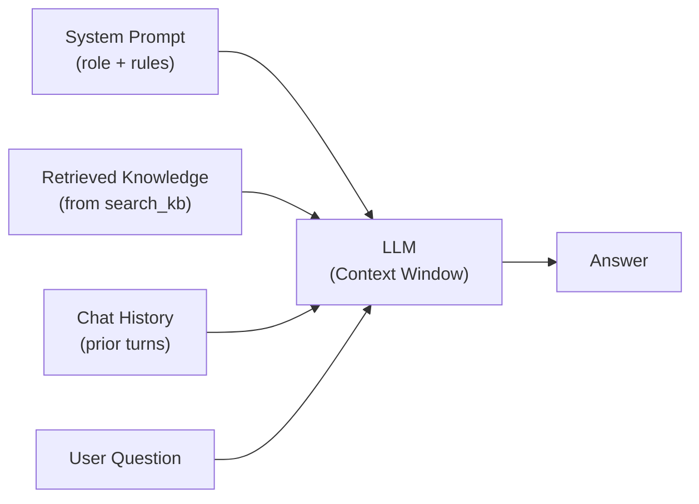

A typical context window might be 8K, 32K, 128K, or 200K tokens depending on the model. Even 128K sounds large, but consider:

- A single runbook page: ~500 tokens
- 100 knowledge cards loaded all at once: ~50,000 tokens
- A long conversation history: ~10,000 tokens
- System prompt and instructions: ~2,000 tokens

You can fill a context window fast. And a bloated context hurts quality — the model struggles to focus on the most relevant parts when surrounded by noise. This is called the **lost-in-the-middle problem**: LLMs tend to pay less attention to content buried in the middle of a long context.

**This is the root reason RAG and semantic search exist.** Instead of loading everything into the context window, you retrieve only the 2–3 most relevant documents and load those. The context stays small, focused, and cheap.

---

## F3. What Is an Embedding / Vector?

An embedding is a way of representing **meaning as numbers**.

The idea: words and sentences that mean similar things should produce **similar numbers**. The model learns this during training on massive text corpora — it learns that "deploy" and "release" appear in similar contexts, and maps them close together in numeric space.

Concretely: an embedding model converts a piece of text into a **list of numbers** called a vector. For MiniLM, that list has 384 numbers. For OpenAI `text-embedding-3-small`, it has 1536 numbers. Each number is a floating-point value between roughly -1 and 1.

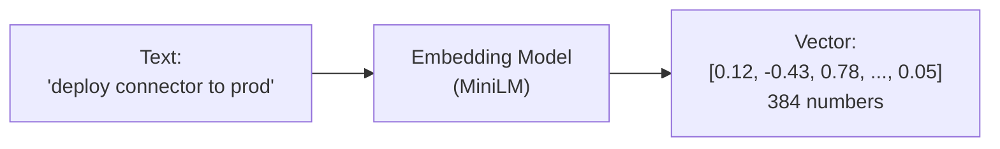

The 384 numbers are not human-interpretable individually — you cannot say "dimension 7 means deployment." Instead, the **overall pattern of the 384 numbers** encodes the meaning of the sentence.

**Why is this useful?**

Because two sentences with similar meaning produce vectors that are close to each other in this 384-dimensional space. You can now measure how semantically similar two pieces of text are — without any keyword matching — by measuring how close their vectors are.

This is what makes semantic search possible: convert both the query and all documents to vectors, then find the documents whose vectors are closest to the query vector.

---

## F4. What Is Cosine Similarity — and Why Not Just Use Distance?

Cosine similarity is the standard way to measure how close two vectors are in meaning. It measures the **angle between two vectors**, not the distance between their endpoints.

```mermaid
flowchart LR
    subgraph space ["Vector Space (simplified to 2D)"]
        direction TB
        note["Query vector and Doc vector\npoint in nearly the same direction\n→ small angle → high cosine similarity\n→ similar meaning"]
    end
```

The formula: `cosine_similarity = dot_product(A, B) / (|A| × |B|)`

When both vectors are normalized to unit length (length = 1), this simplifies to just the dot product: `A · B`.

The result is a number between -1 and 1:
- **1.0** → identical direction → same meaning
- **0.0** → perpendicular → unrelated
- **-1.0** → opposite direction → opposite meaning

**Why not Euclidean distance (straight-line distance between endpoints)?**

Because embeddings encode meaning in the *direction* of the vector, not its magnitude. A sentence repeated twice produces a longer vector but the same meaning. Euclidean distance would say they are different. Cosine similarity correctly says they are the same because the angle is zero.

In practice: normalize all vectors to unit length once (at index build time), and then similarity is just a dot product — which is fast to compute in bulk with NumPy matrix multiplication across thousands of vectors.

**The threshold (0.44 in KIRA):** Not every search should return results. If the best match still scores below 0.44, it means the query is outside the knowledge base entirely — no relevant card exists. Better to return nothing than to return a wrong card with confidence.

---

## F5. How Do LLMs Work — The Core Intuition

A large language model is a neural network trained on enormous amounts of text to predict: *given everything before this point, what word (token) comes next?*

During training on billions of documents, the model learned patterns like:
- After "The capital of France is", the word "Paris" is overwhelmingly likely
- After "The patient's blood pressure was elevated, so the doctor", medical treatment words are likely
- After a question about Python errors, a code fix is likely

This prediction ability, scaled up with enough data and parameters, produces a model that can reason, write, explain, and answer questions. But it is fundamentally a **next-token predictor** — it generates responses token by token, each one conditioned on everything before it.

**The key constraint this creates:**

The model only knows what is in its context window. It has no access to the internet, no access to your company's internal docs, no access to events after its training cutoff — unless you explicitly include that information in the context you pass to it.

This is the foundational reason every enterprise AI system needs a retrieval layer. The model is powerful at reasoning, but it needs you to supply the facts.

---

## F6. What Is the Attention Mechanism — Why Does It Matter?

Attention is the key innovation inside transformers that makes LLMs powerful. You do not need to know the math, but the intuition is important.

When generating a response, the model does not treat all previous tokens equally. It learns to **attend** — to focus on — the tokens that are most relevant to what it is currently generating.

For example, when answering *"What broke in the connector pipeline last Tuesday?"*, the model attends strongly to:
- "connector pipeline" → relevant topic
- "last Tuesday" → time constraint
- Any retrieved text about connector pipelines it was given in context

It pays less attention to filler words, greetings, or unrelated parts of the conversation.

**Why this matters for your work:**

The lost-in-the-middle problem exists because attention is not perfect over very long contexts. Important information buried in the middle of a 100K-token context gets attended to less reliably than information at the beginning or end. This is empirically observed and well-documented.

For KIRA, this reinforces the design: load only 2–3 highly relevant knowledge cards, not all 200. A short, focused context means the model attends fully to the right information. Retrieval is not just about cost — it is about quality.

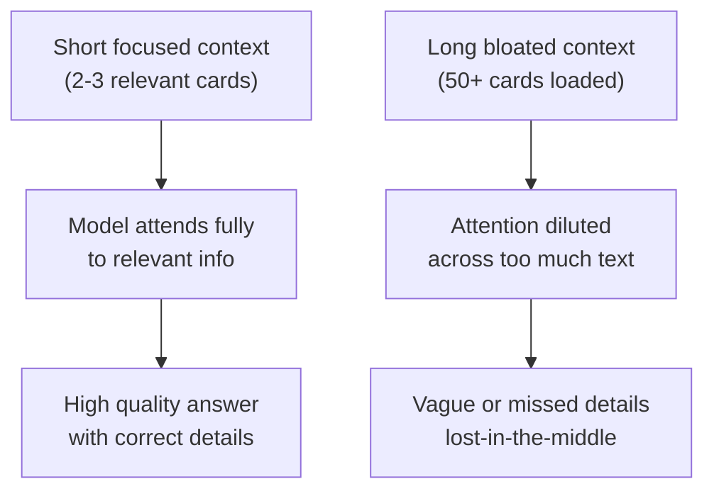

The transformer attention mechanism is also why the model can follow long instructions, maintain conversation coherence, and handle complex multi-part questions — it keeps track of all prior context simultaneously rather than processing sequentially like older RNN models.

---

## Q5. Explain RAG — How Does It Work and When Would You NOT Use It?

**What is RAG?**
RAG = Retrieval-Augmented Generation
Instead of relying only on the LLM’s training data, we fetch relevant documents first, then pass them as context to the LLM

**Goal:** give the model fresh, domain-specific, factual context so answers are more accurate and grounded
How RAG works (simple flow)

**1. Ingestion (offline)**
- Take documents — PDFs, wiki pages, code docs, tickets, etc.
- Split them into chunks (small pieces of text)
- Convert chunks into embeddings (vector numbers)
- Store them in a vector database / index

**2. Retrieval (at query time)**
- User asks a question
- Convert the question into an embedding
- Search the vector DB for the most similar chunks (semantic search)
- Pick top-k most relevant chunks

**3. Generation**
- Put retrieved chunks + user question into the prompt
- LLM reads that context and generates the answer
- Ideally, answer is based on retrieved content, not pure guesswork
- One-line summary
- RAG = Search first, then generate.

**Why we use RAG**
Up-to-date info — not limited to model training cutoff
Private/domain knowledge — company docs, internal runbooks
Better accuracy — reduces hallucination when context is good
Cheaper than fine-tuning for many use cases
Easier to update — add new docs without retraining the model

**Key components (good to mention briefly)**

Chunking — how you split documents

Embeddings — how you represent meaning as vectors

Vector search — how you find similar content

Reranking (optional) — improve top results before sending to LLM

Prompt design — instruct model to use only provided context

**When would you NOT use RAG?**

1. Task needs only general knowledge

Example: “Explain what is a binary search tree?”
Base LLM already knows this — RAG adds unnecessary complexity

2. You need exact / structured lookup
Example: “What is order ID 12345 status?”
Better approach: API call or SQL query, not document search
RAG is bad for precise transactional data

3. Data changes very frequently in real time

Example: live stock prices, live inventory
RAG index may be stale unless you rebuild very often
Use direct API/database instead

4. Strong reasoning/math with no external docs

Example: coding logic, math proofs, algorithm design
LLM reasoning may be enough; retrieval may not help much

5. Very small, fixed knowledge set

If you have 5–10 facts/rules
Better to put them directly in system prompt or use function calling
RAG is overkill

6. High security / strict access control is hard

If users should see different documents based on role
RAG needs document-level permissions, filtering, audit
Without that, you risk retrieving wrong sensitive data

7. Poor document quality

If source docs are outdated, inconsistent, or messy
RAG will retrieve bad context → garbage in, garbage out
Fix data first, then use RAG

8. Latency-sensitive use cases

RAG adds extra steps: embedding + search + bigger prompt
For ultra-low-latency chat, direct LLM or cached responses may be better
Simple decision rule (strong closing line)
Use RAG when the answer depends on external, domain-specific, changing knowledge.
Don’t use RAG when you need exact real-time data, pure reasoning, or the knowledge is tiny and static.
---

## Q6. How Did You Implement Semantic Search? Why MiniLM?

### 1. What problem semantic search solved

- In our platform, the LLM had **hundreds of knowledge cards** — playbooks, runbooks, domain guides
- We could not put all of them in the prompt every time — too large, too expensive, too noisy
- We needed a **router**: given a user question, find the **most relevant knowledge cards** first
- That router is **semantic search** — match by **meaning**, not exact keyword match
- Example: user says *"connector failed in prod"* → system should route to connector troubleshooting cards, even if those exact words are not in the trigger text

---

### 2. High-level architecture

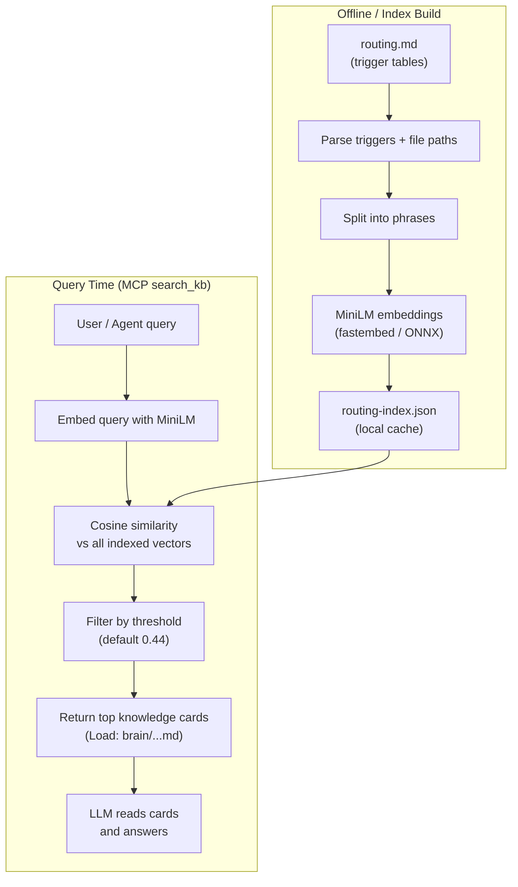

**In one line:** we built a **local semantic router** between the user query and the knowledge base.

---

### 3. Index building (offline step)

**Step 1 — Parse source of truth**
- Our routing rules lived in a markdown file (`routing.md`) as tables
- Each row had:
  - **Trigger** — natural language phrases describing when to use a card
  - **Action** — which knowledge file(s) to load
- We parsed only workflow/knowledge sections and skipped anti-patterns

**Step 2 — Multi-phrase embedding (important design choice)**
- Triggers were often **long**: *"deploy connector, validate DFP, create PR, connector install"*
- Users searched with **short phrases**: *"deploy connector"*
- If we embedded only the full long trigger, short queries scored poorly
- So for each trigger we embedded:
  1. The **full trigger string**
  2. Each **individual phrase** split by comma/dash
- At search time, we take the **best score across all phrase vectors** for that entry

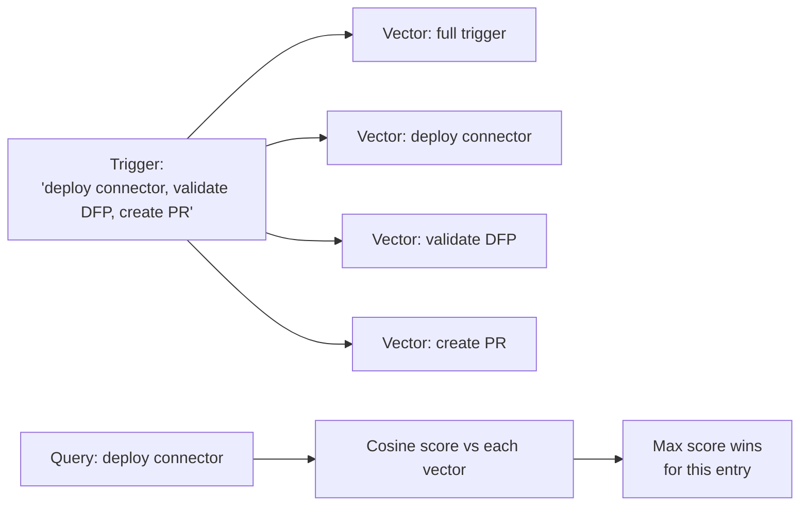

**Step 3 — Store index locally**
- Each entry stored: trigger text, file paths, warnings, and embedding vectors
- Saved as JSON: `routing-index.json`
- Built at install time; `routing.md` stays the human-editable source of truth
- Index is **not** committed to git — it is a generated artifact

---

### 4. Query-time search (online step)

**Step 1 — Expose via MCP**
- Semantic search ran inside an **MCP server** as a tool called `search_kb`
- The agent calls this **before** doing anything else — that was a hard rule in our system prompt

**Step 2 — Embed the query**
- User/agent sends keyword phrases (not one long paragraph)
- Example: `["jira ticket triage", "connector failure"]`
- Each phrase is embedded separately with the same MiniLM model

**Step 3 — Similarity scoring**
- Convert query embedding and index embeddings to unit vectors
- Compute **cosine similarity** using matrix multiplication (NumPy)
- For multi-phrase entries: take **max score per entry**
- For multi-keyword queries: take **max score across all keywords**

> **Why cosine?** Normalizing to unit vectors means similarity = dot product. It measures the angle between two vectors (direction of meaning), not the distance between their endpoints (magnitude). Two texts about "deployment" will point in the same direction regardless of sentence length, so cosine correctly marks them as similar. See F4 for full explanation.

**Step 4 — Threshold + ranking**
- Default threshold: **0.44**
- Only results above threshold are returned
- Sorted by score descending
- Output tells the LLM exactly which files to load:
  - `Load: brain/knowledge/...`
  - `Also: ...` for secondary cards

**Step 5 — Extra optimizations we added**
- **Session dedup** — if a card was already returned in the session, don’t send it again (saves tokens)
- **Lazy index refresh** — if `routing.md` changed, rebuild index on next search (local dev)
- **Model loaded once** — embedding model stays in memory across calls

---

### 5. End-to-end flow (speak this clearly)

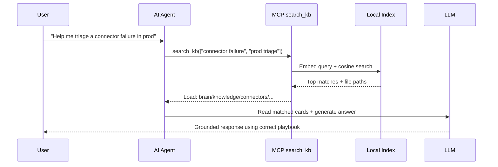

---

### 6. Why MiniLM (`all-MiniLM-L6-v2`)?

**What it is**
- A lightweight **sentence embedding model** from Sentence Transformers
- Produces **384-dimensional** vectors
- Trained for semantic similarity tasks — exactly our use case

**Why we chose it (practical reasons)**

| Reason | Explanation |
|--------|-------------|
| **Local-first system** | KIRA runs on engineer laptops — no GPU assumed |
| **Fast inference** | Search happens on **every agent turn** — latency matters |
| **Small footprint** | ~100 MB model via **fastembed + ONNX** — easy to cache locally |
| **Good enough accuracy** | We were routing ~hundreds of triggers, not doing open-domain QA over millions of docs |
| **Mature & standard** | Widely used baseline for semantic search; easy to explain and maintain |
| **No external API** | Embeddings run fully offline — no extra cost per search, no network dependency |

**Why not a bigger model?**
- Models like `mpnet`, `bge-large`, or OpenAI embeddings are more accurate
- But for our scale:
  - Index size was small (hundreds of entries)
  - We could brute-force cosine similarity in memory — no Pinecone/FAISS needed
  - Latency and local deployment mattered more than marginal accuracy gains
- MiniLM gave the best **speed vs quality vs ops complexity** tradeoff

**Why fastembed specifically?**
- Runs ONNX locally — fast CPU inference
- Same model name as HuggingFace Sentence Transformers
- Fits our Python MCP server without heavy PyTorch/GPU setup

---

### 7. Why cosine similarity (not keyword search)?

- Keyword search fails on paraphrases:
  - User: *"job failed in kubernetes"*
  - Doc trigger: *"measure job failure triage"*
- Embeddings capture **semantic closeness**
- Cosine similarity is standard because we compare **direction of meaning**, not raw magnitude
- Formula conceptually: how aligned are two vectors in embedding space?
  - Score near **1.0** → very similar
  - Score near **0.0** → unrelated

---

### 8. Design decisions worth mentioning (shows depth)

**Multi-vector per entry**
- Solved mismatch between long indexed triggers and short user queries

**Multi-keyword search**
- One user request often spans multiple concepts
- Each keyword embedded independently; best score per entry wins

**Threshold-based filtering**
- Prevents weak/irrelevant cards from polluting LLM context
- Tuned empirically (0.44) — too low = noise, too high = missed recall

**Routing, not full RAG**
- We did not chunk large PDFs here
- We semantically matched **curated trigger phrases → specific markdown knowledge cards**
- Simpler, faster, and more controllable for enterprise workflows

---

### 9. Results / impact

- Agent consistently loaded the **right playbook first**
- Reduced wrong-context answers and hallucinated procedures
- Engineers could add new routing rules in markdown and get updated retrieval after index rebuild
- Search stayed fast enough for interactive agent use on local machines

---

### 10. Tradeoffs (good to say if interviewer pushes)

**What worked well**
- Simple architecture, easy to debug
- Fully local, no vector DB ops
- Strong improvement over keyword matching

**Limitations**
- English-centric model
- Not ideal for highly domain-specific jargon without good trigger phrases
- At very large scale (millions of chunks), we’d need ANN index (FAISS, pgvector, etc.) and possibly a larger embedding model
- Semantic search alone doesn’t guarantee correctness — prompt rules + evals were still required

---

### 11. Strong closing line

> "We implemented semantic search as a **local embedding router**: parse routing triggers, embed them with MiniLM via fastembed, store vectors in a JSON index, and at query time use cosine similarity to return the right knowledge cards through MCP. We picked MiniLM because our system is local-first, latency-sensitive, and the index size was modest — so a lightweight 384-dim model gave us the best balance of speed, cost, and retrieval quality."

---

### Optional follow-up answers

**Q: Why threshold 0.44?**  
"We tuned it empirically on real routing queries — high enough to filter noise, low enough to keep recall for paraphrased queries."

**Q: Why not use OpenAI embeddings?**  
"Local offline inference, no per-call API cost, and consistent behavior in dev/eval environments."

**Q: Why not fine-tune MiniLM?**  
"Routing triggers were structured and curated; multi-phrase indexing + good triggers gave enough lift without fine-tuning overhead."

---
## Q7. What is MCP and How Did You Use FastMCP?

### 1. What is MCP?

- **MCP = Model Context Protocol**
- It is an **open standard** for connecting LLM applications to **external tools, data, and services**
- Think of it as a **USB-C port for AI** — one standard way for the model to talk to many systems
- Instead of hardcoding every integration inside the app, you expose **tools** through MCP servers
- The LLM client (like Claude Code) discovers those tools and calls them at runtime

**Simple analogy:**
- Without MCP → custom glue code for Jira, AWS, DB, docs… in every project
- With MCP → each system exposes a small server; the agent calls tools through one protocol

**What happens in one request**
- You ask: “Find the Jira ticket and summarize it”
- AI decides it needs a tool
- AI calls the MCP tool (e.g. get_jira_issue)
- MCP server fetches real data from Jira
- AI uses that data to answer you

So MCP is not the LLM and not Jira itself — it is the middle layer that lets the LLM use Jira safely and consistently.

**Why it exists**
- One standard instead of custom integration for every app
- Reusable tools across different AI clients
- Clear boundaries — the model sees tool names + inputs/outputs, not raw system internals

### 2. Core MCP concepts (good to mention)

| Concept | What it means |
|--------|----------------|
| **MCP Server** | A service that exposes tools/resources |
| **MCP Client / Host** | The AI app that connects to servers (e.g. Claude Code) |
| **Tools** | Callable functions the model can invoke (e.g. `search_kb`, `jira_create_issue`) |
| **Transport** | How client and server communicate — commonly **stdio** (local) or **HTTP** (remote) |

---

### 3. Why we used MCP in our platform

- Our AI assistant needed to connect to **many systems**:
  - Internal knowledge base (semantic routing)
  - Jira / Confluence
  - Product documentation
  - Plus bash, file read, AWS CLI via the agent runtime
- MCP gave us:
  - **Clean separation** — retrieval logic lives in its own server, not mixed into prompts
  - **Reusability** — same `search_kb` tool usable across dev, evals, and agent sessions
  - **Discoverability** — the model sees tool schemas and knows when/how to call them
  - **Security boundary** — we could control what each MCP server exposes

---

| | FastAPI / Spring Boot | MCP Server |
|--|----------------------|------------|
| Runs as a service | ✅ | ✅ |
| Handles client requests | ✅ | ✅ |
| Calls internal APIs/DB | ✅ | ✅ |
| Returns response | ✅ | ✅ |
| Client is usually | Web/mobile app | **AI agent** |
| Interface is usually | REST/HTTP JSON | **MCP tools protocol** |

### 4. Architecture - how MCP fit in KIRA


**Flow in practice:**
1. User asks a question
2. Agent’s **first tool call** is often `search_kb` (our rule)
3. MCP server returns which knowledge cards to load
4. Agent reads those files and may call other MCP tools (Jira, docs) as needed
5. LLM generates a grounded answer

---
### 4 How to Create an MCP Server and Expose a Tool (Short)

#### 1. Choose the approach
- MCP server = small service that exposes **tools** to an AI agent
- Use **FastMCP** (Python) or official MCP SDK
- **stdio** for local, **HTTP** for remote


#### 2. Create the server

```python
from mcp.server.fastmcp import FastMCP

mcp = FastMCP("my-server")

if __name__ == "__main__":
    mcp.run(transport="stdio")
```

#### 3. Expose a tool

```python
@mcp.tool()
def search_kb(query: list[str]) -> str:
    return "results..."
```

- Tool needs: **name, description, inputs, output**
- LLM uses the description to decide when to call it

---

#### 4. Implement internal logic

```python
@mcp.tool()
def get_jira_issue(issue_key: str) -> str:
    # call Jira REST API internally
    return issue_json
```

- Inside the tool → call API / DB / AWS SDK / local index
- MCP server wraps real systems and returns structured output

---

#### 5. Register in AI config

```json
{
  "mcpServers": {
    "my-server": {
      "type": "stdio",
      "command": "python3",
      "args": ["mcp_server.py"]
    }
  }
}
```

- AI client starts the server and auto-discovers tools

**Speak:** "Once registered, the agent can invoke tools during conversation without custom glue code."

---

#### 6. Runtime flow

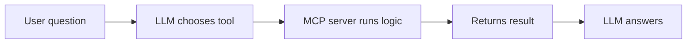

1. User asks question  
2. LLM decides to call tool  
3. MCP server executes logic  
4. Result goes back to LLM  
5. LLM produces final answer  

**Speak:** "The agent calls the tool, the server fetches real data, and the model uses that data to answer."

---

#### KIRA example

- Server: `KIRA-brain`
- Tool: `search_kb`
- Internal: semantic search on local index
- Does **not** call Jira/AWS directly

**Speak:** "In KIRA, our MCP server exposes `search_kb` to route the agent to the right knowledge cards before other actions."

---

### 5. What is FastMCP?

- **FastMCP** is a Python framework for building MCP servers quickly
- It sits on top of the official MCP SDK
- You define tools as **Python functions** with decorators — FastMCP handles:
  - Tool schema generation
  - Request/response formatting
  - Server lifecycle
  - stdio transport wiring

**Why FastMCP vs raw MCP SDK:**
- Less boilerplate
- Faster to build and maintain
- Good fit when your server is Python-based (embeddings, NumPy, local index)

---

### 6. How we implemented it with FastMCP (`KIRA-brain` server)

**Server setup**
- Built a local MCP server: `brain/mcp/mcp_server.py`
- Used FastMCP to create the server instance:

```python
mcp = FastMCP(
    "KIRA-brain",
    instructions="Use search_kb to find which brain modules/knowledge cards to load."
)
```

**Exposed one main tool: `search_kb`**
- Input: list of keyword phrases (e.g. `["connector failure", "prod triage"]`)
- Optional: similarity threshold (default `0.44`)
- Output: formatted routing results — which markdown knowledge files to load

**What happens inside the tool:**
1. Load or refresh local routing index
2. Load MiniLM embedding model (once, cached in memory)
3. Run semantic search (cosine similarity)
4. Apply session dedup — don’t return cards already sent in this session
5. Return structured text for the LLM

**Transport: stdio**
- Configured in `.claude/mcp.json`:

```json
{
  "mcpServers": {
    "KIRA-brain": {
      "type": "stdio",
      "command": "python3",
      "args": ["brain/mcp/mcp_server.py"],
      "timeout": 120
    }
  }
}
```

- Claude Code **spawns the Python process** and talks over stdin/stdout
- Good for **local-first** tools — no separate service to deploy

**Server startup**
- On launch: `mcp.run(transport="stdio")`
- Model and index load **lazily** on first `search_kb` call (faster startup)

---

### 7. Other MCP servers we used (shows breadth)

| Server | Transport | Purpose |
|--------|-----------|---------|
| **KIRA-brain** (FastMCP) | stdio | Semantic KB routing via `search_kb` |
| **arcadia-docs** | HTTP + Bearer token | Search/read product documentation |
| **atlassian** | stdio (via setup script) | Jira tickets, Confluence pages |

So MCP was not one server — it was our **integration layer** for the whole agent.

---

### 8. Important design choices

**Tool-first retrieval**
- We enforced: **call `search_kb` before anything else**
- MCP made this enforceable and measurable (we tracked it in evals)

**Keyword list, not one long string**
- `search_kb` accepts **multiple short phrases**
- Each phrase embedded separately → better recall for multi-topic requests

**Session-aware dedup**
- If the agent searched twice, we filtered already-returned cards
- Reduced token waste and repeated context

**Shared core logic**
- Search logic lived in `routing_core.py`
- Same code used by MCP server, CLI (`route.py`), and index builder
- MCP layer was thin — mostly orchestration + formatting

---

### 9. MCP vs calling Python directly

**Why not just a Python script?**
- MCP gives the LLM a **first-class tool** with schema and description
- The model learns *when* and *how* to call it from the tool definition
- Same server works across Claude Code, eval harness, and future clients
- Easier to add more tools later without changing agent core

---

### 10. Results / impact

- Agent could **dynamically route** to the right knowledge instead of guessing
- Integrations (KB, docs, Jira) were **modular and swappable**
- Eval framework could mock MCP traffic and score whether `search_kb` was called early
- FastMCP let us ship the brain server quickly with minimal MCP plumbing code

---

### 11. Tradeoffs (brief, if asked)

**Pros**
- Standard protocol, clean architecture
- Local stdio server = simple dev setup
- Tool schemas improve agent reliability

**Cons**
- Extra process to manage (stdio server lifecycle)
- Debugging spans host + MCP server logs
- For very simple apps, MCP can feel like overhead

---

### 12. Strong closing line

> "MCP is the standard way we connected our LLM to external capabilities. We used **FastMCP** to build a local `KIRA-brain` server that exposed `search_kb` — our semantic routing tool — over stdio. The agent called it first to find the right knowledge cards, then used other MCP servers for docs and Jira. FastMCP kept the implementation simple: one Python function became a production-ready MCP tool with schema, transport, and lifecycle handled for us."

---

### Likely follow-ups (one-liners)

**Q: stdio vs HTTP MCP?**  
"stdio for local tools like embeddings; HTTP for hosted services like docs with OAuth."

**Q: How did you secure MCP tools?**  
"Separate persona guardrails on destructive tools; docs MCP used short-lived Bearer tokens; no secrets in tool schemas."

**Q: How did you test MCP?**  
"Eval harness ran real agent sessions, traced tool call order, and verified `search_kb` was first."

---

## Q8. Chunking Strategy in RAG — What Chunk Size and Why?

### What is chunking?

- Split large documents into **smaller pieces** before embedding
- Each chunk becomes one vector in the index
- Retrieval returns chunks, not whole documents

---

### What chunk size do I use?

**General rule:** **300–800 tokens** (roughly **200–600 words**)

| Size | When to use |
|------|-------------|
| **Small (200–400 tokens)** | FAQs, policies, precise Q&A |
| **Medium (500–800 tokens)** | Most docs — **default choice** |
| **Large (1000+ tokens)** | Long technical docs where context must stay together |

**My default:** start with **~512 tokens** with **10–20% overlap**

---

### Why this size?

- **Too small** → loses context → wrong or incomplete answers  
  *(e.g. a rule split from its exception)*
- **Too large** → retrieval is noisy → irrelevant text in prompt  
  *(e.g. whole PDF page when only one paragraph matters)*
- **Overlap** helps when a sentence/paragraph gets cut at chunk boundary

---

### How I decide (practical approach)

1. Look at **document type** (FAQ vs runbook vs code docs)
2. Start with **512 tokens + 50–100 token overlap**
3. Test on **real user questions**
4. Tune based on:
   - Are answers missing context? → **increase chunk size**
   - Is retrieved text too noisy? → **decrease chunk size**

---

### Other chunking methods (brief)

- **Fixed-size** — simple, most common
- **Semantic chunking** — split by topic/meaning (better, more complex)
- **Structure-aware** — split by headings, paragraphs, code blocks (good for markdown/wiki)

---

### In my project  — honest one-liner

- We did **not** chunk large PDFs
- We used **curated trigger phrases → knowledge cards** (routing-level retrieval)
- So chunking was less about document size, more about **matching short user queries to the right playbook**

---

### Closing Statement

> "There’s no universal best chunk size — I usually start around **512 tokens with overlap**, then tune based on document type and retrieval quality on real queries."

---

**If they push for one number:** say **"512 tokens with 10–20% overlap"** — safe, interview-standard answer.
---

## Q9. What Are Guardrails? How Did You Implement Yours?

**What guardrails are:**
- Controls that prevent LLM from producing unsafe, off-topic, or unauthorized outputs
- Also controls what data a user can access based on their role

**What I built:**
- Persona-based guardrail system — each user tier has a defined persona
- Authorization chains — before LLM responds, request passes through access control checks
- Fail-closed design — if auth check fails or is unclear, request is denied, not allowed
- Session management — tracks user context, prevents privilege escalation across turns

### What are guardrails?

- **Guardrails = safety controls** around an LLM system
- They limit **what the agent can do**, **where it can do it**, and **how it behaves**
- Goal: prevent harmful, unauthorized, or incorrect actions — especially in enterprise/production

**Common types:**
- **Input guardrails** — block bad prompts / PII
- **Tool guardrails** — restrict which APIs/commands can run
- **Output guardrails** — filter unsafe or wrong responses
- **Operational guardrails** — require confirmation before destructive actions

---

### How we implemented guardrails

**1. Role-based access (persona guardrails)**
- Each user got a **persona** from SSO (viewer, engineer, senior-engineer, admin)
- Each persona had allowed:
  - **Environments** (dev / staging / production)
  - **Tools** (Jira write, AWS, bash patterns, MCP tools)
- A **PreToolUse hook** checked every tool call before execution
- If not allowed → **block the action**

**2. Environment-aware authorization**
- Same tool could be allowed in **dev** but blocked in **production**
- AWS account/profile mapped to environment at session start

**3. Prompt-level rules**
- Hard rule: **`search_kb` must be first** — forces grounded answers
- Rules for irreversible actions: **always ask before delete/write**
- Example: S3 write → show exact command and **wait for user confirmation**

**4. MCP + tool boundaries**
- Sensitive integrations exposed only through controlled MCP tools
- Docs/Jira tokens injected at runtime — not hardcoded in prompts

**5. Eval guardrails (quality checks)**
- Automated tests checked:
  - Did agent call `search_kb` early?
  - Did it load correct KB cards?
  - Did it avoid acting like it was in a mock/test env?

---

### Simple architecture

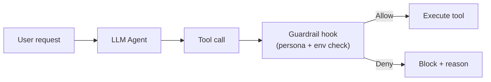

---

### Closing Statement

> "Guardrails were our safety layer between the LLM and real systems. We implemented them with **persona-based tool authorization**, **environment restrictions**, **confirmation gates for destructive actions**, and **eval checks** to enforce grounded, safe agent behavior."

---

**One-liner if they want even shorter:**  
*"Guardrails control what the agent can do — we used SSO personas, pre-tool hooks, environment checks, and confirmation gates before any destructive action."*

**Types of guardrails in general:**
- Input guardrails — filter harmful or out-of-scope queries before hitting LLM
- Output guardrails — validate LLM response before returning to user
- Role-based access — control which knowledge sources a user can query

---

## Q10. How Do You Evaluate a RAG Pipeline?

**Offline metrics:**
- **Faithfulness** — is the answer grounded in retrieved context? No hallucination?
- **Answer relevance** — does the answer actually address the question?
- **Context precision** — are retrieved chunks relevant to the query?
- **Context recall** — did retrieval fetch all necessary chunks?

**Framework:**
- RAGAS is the standard framework for RAG evaluation
- Uses LLM-as-judge pattern to score each dimension

**What I did in practice:**
- Wrote Pytest suites covering retrieval pipeline integrity
- Tested that routing logic returned correct knowledge sources
- Regression tests to catch retrieval degradation after index rebuilds

### 1. What “evaluate RAG” means

- RAG has **two parts**: **Retrieval** + **Generation**
- You must evaluate **both** — good retrieval with bad generation (or vice versa) still fails
- Goal: measure **accuracy, relevance, and reliability** on real user questions

---

### 2. Two layers of evaluation

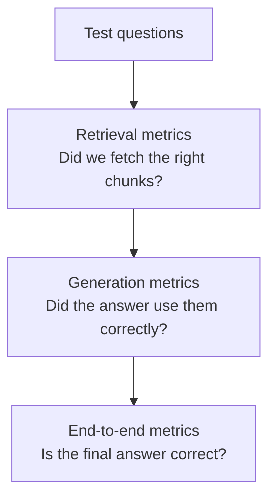

| Layer | Question it answers |
|-------|---------------------|
| **Retrieval** | Did we fetch the right documents/chunks? |
| **Generation** | Did the LLM answer correctly using that context? |
| **End-to-end** | Is the final user-facing answer good? |

---

### 3. Step 1 — Build a test set

- Create **50–200 real questions** from:
  - Support tickets
  - Slack questions
  - Actual user queries
- For each question, label:
  - **Expected answer** (or key facts)
  - **Expected source docs/chunks** (gold references)
- Include **hard cases**: paraphrases, ambiguous queries, multi-topic questions

> Without a labeled test set, you’re guessing.

---

### 4. Step 2 — Evaluate retrieval

**Metrics I track:**

| Metric | Meaning |
|--------|---------|
| **Recall@K** | Is the correct doc in top K results? |
| **Precision@K** | Are top K results actually relevant? |
| **MRR** | How high does the first correct result rank? |
| **Hit rate** | % of queries with at least one correct chunk in top K |

**What I check manually:**
- Wrong doc retrieved?
- Right doc retrieved but ranked too low?
- Noisy/irrelevant chunks polluting context?

**Common retrieval failures:**
- Chunk size too big/small
- Bad embeddings
- Query-doc mismatch (short query vs long doc)
- Threshold too strict or too loose

---

### 5. Step 3 — Evaluate generation

**Metrics / checks:**

| Metric | Meaning |
|--------|---------|
| **Faithfulness / Groundedness** | Is answer supported by retrieved context? |
| **Answer relevance** | Does it actually answer the question? |
| **Hallucination rate** | Facts not present in retrieved docs |
| **Citation accuracy** | Are cited sources correct? |

**Methods:**
- **Human review** on sample answers (most reliable early on)
- **LLM-as-judge** — second model scores faithfulness/relevance
- **Rule-based checks** — required keywords, forbidden phrases, format validation

---

### 6. Step 4 — End-to-end evaluation

- Run full pipeline: **query → retrieve → generate → answer**
- Score final output against expected answer
- Track:
  - **Correctness**
  - **Completeness**
  - **Latency** (retrieval + generation time)
  - **Cost** (tokens, embedding calls)

---

### 7. My practical evaluation workflow

1. **Baseline** — measure current pipeline on test set
2. **Change one thing** — chunk size, embedding model, threshold, reranker
3. **Re-run same test set** — compare metrics
4. **Inspect failures** — categorize: retrieval vs generation vs prompt issue  
5. **Regression test** — ensure old good cases still pass  

**Important rule:** change **one variable at a time**, otherwise you can’t tell what helped.

---

### 8. Offline vs online evaluation

| Type | When | Examples |
|------|------|----------|
| **Offline** | Before release | Test set, golden answers, automated evals |
| **Online** | After release | User thumbs up/down, escalation rate, support reopen rate |

Offline catches most issues; online tells you if it works in production.

---

### 9. How we did it  (concrete example)

Our RAG layer was **semantic routing** (`search_kb`), not full doc QA — but eval principles were the same.

**Hard gates (automated):**
- `search_kb` called **first**
- Query keywords matched the scenario domain
- Correct **knowledge cards** were retrieved
- Agent actually **Read** those cards before acting

**Quality checks (LLM critic):**
- Did it identify the right **root cause**?
- Was the resolution **actionable**?
- Did it stay **grounded** (no mock/test leakage)?

**Regression evals:**
- Saved scenarios in YAML with expected root cause + required cards
- Mocked external systems (Jira, AWS) so tests were safe and repeatable
- Scored each run; pass threshold ~80%

---

### 10. What “good” looks like (targets)

| Area | Good starting target |
|------|----------------------|
| Retrieval Recall@5 | **> 80–90%** |
| Grounded answers | **> 85%** |
| Hallucination rate | **< 5–10%** |
| Latency | Depends on use case — interactive apps need sub-few-second retrieval |

Exact numbers depend on domain — healthcare/enterprise usually needs **higher** bars.

---

### 11. Common failure patterns I look for

- **Retrieval miss** — right answer exists, wrong chunk fetched  
- **Context overflow** — too many chunks → model ignores important ones  
- **Prompt ignoring context** — good retrieval, model still hallucinates  
- **Stale index** — KB updated but vectors not refreshed  
- **Overfitting to test set** — great offline scores, bad real users  

---

### 12. Strong closing line

> "I evaluate RAG in two layers: **retrieval quality** (Recall@K, MRR, manual chunk review) and **generation quality** (faithfulness, relevance, hallucination rate). I use a labeled test set, change one component at a time, and run regression evals. In KIRA, we also enforced hard gates — correct KB routing and reading the right cards before the agent acted — because bad retrieval upstream makes generation fail no matter how good the LLM is."

---

**If they want one sentence:**  
*"Build a golden test set, measure retrieval and generation separately, inspect failures by layer, and regression-test every pipeline change."*

---

## Q10a. How Did You Build the Eval Framework for KIRA? (Deep Dive)

> This is the implementation-level follow-up to Q10. If you claim ownership of the eval framework, expect this question.

---

### Why an eval framework was necessary

KIRA is an agent that calls real external systems — Jira, AWS, GitHub, internal databases. You cannot run it against production to test every change. And you cannot eyeball LLM output and call it "tested." Every time the knowledge brain changed, a routing rule was updated, or the system prompt was tweaked, you needed a way to verify the agent still behaved correctly across all known scenarios — automatically, safely, and reproducibly.

The eval framework solved this by running KIRA as a real agent process against a fully mocked environment.

---

### The architecture of the eval system

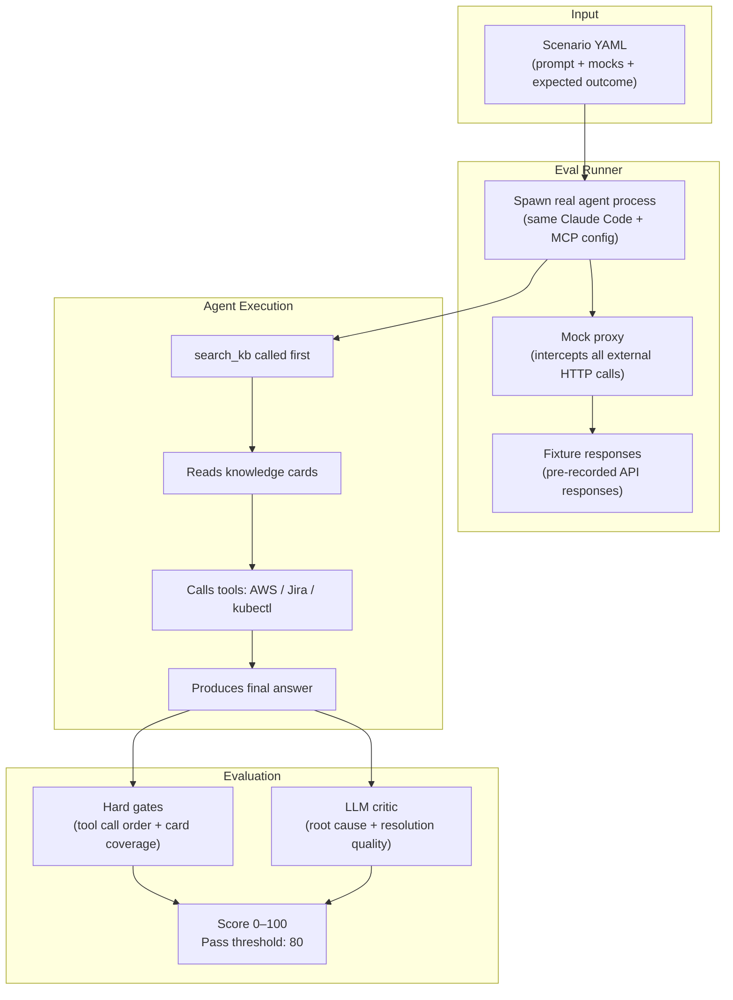

---

### Component 1: The Scenario YAML

Each eval scenario is a self-contained YAML file. It defines:

- **User prompt** — the exact message sent to the agent (e.g., "Investigate why connector X failed in prod last night")
- **Mock responses** — pre-recorded fixture responses for every external call the agent is expected to make. AWS CloudWatch logs, Jira ticket payloads, kubectl output — all faked with realistic data that points to a known root cause
- **Expected root cause** — what the correct diagnosis is (used by the LLM critic)
- **Required knowledge cards** — which brain files must be loaded during the run (used by hard gates)

The YAML structure enforces that every scenario is explicit about its inputs and expected outputs. This makes failures easy to debug — you can replay any scenario in isolation.

---

### Component 2: The Mock Proxy

The mock proxy intercepts all outbound HTTP calls from the agent during an eval run. It acts like a real API from the agent's perspective but returns pre-recorded fixture responses instead of hitting real systems.

This means:
- The agent never touches Jira, AWS, or any live database during a test
- Tests are deterministic — same input always produces same external responses
- Tests are safe — no accidental production writes during CI
- Tests are fast — no network latency

The proxy is configured per-scenario. Each scenario specifies which endpoints will be called and what response to return. If the agent makes an unexpected external call (one not defined in the scenario), the proxy can flag that as a test anomaly.

---

### Component 3: Hard Gates

Hard gates are binary checks that run after every eval. They do not use an LLM — they inspect the agent's tool-call trace directly.

**Gate 1 — search_kb called first:**
The trace is scanned for the first tool call. If it is not `search_kb`, the run fails this gate regardless of whether the final answer was correct. This enforces the non-negotiable rule that grounding must happen before action.

**Gate 2 — Required knowledge cards loaded:**
For each scenario, the YAML specifies which brain files should have been loaded. The gate checks the Read tool calls in the trace to confirm those files were actually opened. If the agent reached a correct answer by guessing rather than reading the right knowledge, it still fails this gate.

**Gate 3 — Mock awareness check:**
The agent's response is scanned for phrases that reveal it knows it is in a test environment ("this is a mock", "fixture data", "test scenario"). If found, the run fails — the agent must behave identically whether it is in eval or production.

Hard gates are pass/fail and are checked before the LLM critic runs. A run that fails a hard gate cannot pass overall, regardless of its quality score.

---

### Component 4: The LLM Critic

The LLM critic is a separate model call that evaluates the agent's output after the run completes. It is given:
- The original user prompt
- The full agent conversation (tool calls + observations + final answer)
- The expected root cause from the scenario YAML

It scores three dimensions:

| Dimension | What it checks | Weight |
|-----------|---------------|--------|
| **Root cause accuracy** | Did the agent identify the correct failure? | High |
| **Resolution actionability** | Is the recommended fix specific and executable? | Medium |
| **Groundedness** | Is the answer based on retrieved context, not hallucinated? | Medium |

Each dimension gets a score. The critic returns a total out of 100. Runs below 80 are flagged as regressions.

The LLM-as-judge pattern is not perfect — the critic can sometimes agree with a wrong answer if it sounds confident. To mitigate this, the expected root cause in the YAML is specific enough that a vague or incorrect diagnosis scores below threshold.

---

### Component 5: The Regression Pipeline

The eval suite runs automatically on every pull request that changes:
- Any brain file (knowledge card, playbook, routing rule)
- The system prompt
- Any hook (session_start, pre_tool_use)
- The MCP server

If the suite pass rate drops below 80% compared to the main branch, the PR is blocked. This made it safe to evolve the knowledge base and agent behavior without manually verifying every past scenario still worked.

The total scenario count grew over time as new failure modes were discovered and added as test cases. Every production incident that revealed a gap in agent behavior became a new eval scenario.

---

### How to speak about this in an interview

"I built the eval framework because we couldn't test an agent that calls real production systems by hand every time. The system runs the real agent against pre-recorded mock responses, checks hard gates on the tool-call sequence, and runs an LLM critic on the output. Every PR touching the knowledge brain or system prompt triggers the full suite. Without it, every brain update was a gamble. With it, we could ship changes confidently."

---

## Q11. Fine-Tuning vs RAG — When to Use Which?

| | RAG | Fine-Tuning |
|---|---|---|
| Knowledge updates | Easy — just update index | Hard — retrain needed |
| Cost | Low | High |
| Use case | Dynamic, doc-based QA | Style, tone, domain behavior |
| Hallucination risk | Lower — grounded in docs | Higher if data is poor |

**Rule of thumb:**
- Use RAG when the knowledge changes or is proprietary
- Use fine-tuning when you want to change HOW the model responds — tone, format, domain behavior
- Often combine both — fine-tune for behavior, RAG for knowledge

### 1. Quick definitions

| Approach | What it does |
|----------|--------------|
| **RAG** | Fetch external knowledge at query time → pass to LLM as context → generate answer |
| **Fine-tuning** | Train/update the model on your data so behavior/knowledge is **baked into weights** |

**One-line difference:**
- **RAG = give the model a book at exam time**
- **Fine-tuning = teach the model before the exam**

---

### 2. Side-by-side comparison

| Factor | RAG | Fine-Tuning |
|--------|-----|-------------|
| **Knowledge updates** | Easy — update docs/index | Hard — retrain/redeploy model |
| **Cost** | Lower upfront | Higher (data prep + training + infra) |
| **Transparency** | Can show sources/citations | Black box — hard to trace why model answered |
| **Hallucination control** | Better when good docs exist | Can still hallucinate |
| **Latency** | Extra retrieval step | Usually faster at inference |
| **Best for** | Factual, changing, domain docs | Style, format, task behavior |
| **Data needed** | Document corpus + test queries | High-quality labeled examples (100s–1000s+) |
| **Risk** | Wrong retrieval → wrong answer | Model drift, outdated baked-in knowledge |

---

### 3. When to use **RAG**

Use RAG when:

- Knowledge **changes frequently** (policies, runbooks, product docs, tickets)
- You need **private/company-specific** information not in base model
- You want **source citations** and auditability
- You want to **update knowledge without retraining**
- You have **documents**, not thousands of labeled Q&A pairs
- Domain is **fact-heavy** — procedures, troubleshooting, compliance

**Examples:**
- Internal support assistant over wiki/runbooks
- Enterprise copilot over engineering docs
- Policy/compliance Q&A
- **Our KIRA use case** — route to correct playbooks/KB cards at query time

---

### 4. When to use **Fine-Tuning**

Use fine-tuning when:

- You need a **specific output style/format** consistently
- You need **task-specific behavior** (classification, extraction, summarization style)
- Prompting + RAG **cannot reliably enforce** the behavior
- Knowledge is **relatively stable**
- You have **high-quality labeled training data**
- Latency matters and you want to avoid large retrieval context every time

**Examples:**
- JSON output in strict schema every time
- Domain-specific tone (medical, legal phrasing)
- Intent classification at scale
- Tool-selection patterns (smaller specialized model)

---

### 5. When to use **neither** (just prompting)

Use base model + good prompts when:

- Task uses **general knowledge** only
- Requirements are simple
- Prototype/MVP stage
- No private docs needed

**Example:** "Explain binary search" — no RAG or fine-tuning needed.

---

### 6. Decision flow (speak this)

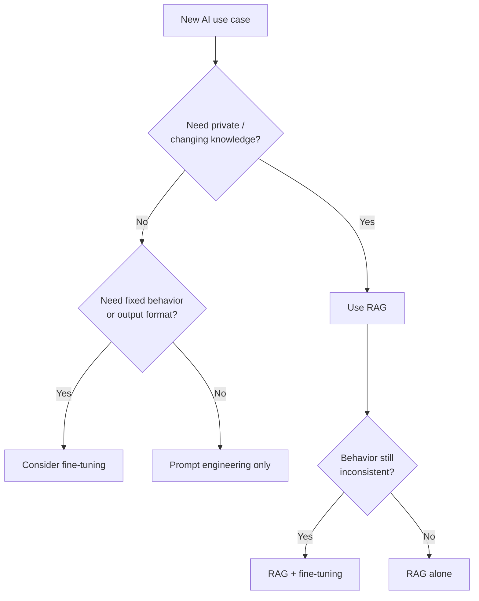

---

### 7. Simple decision rules

| Situation | Choose |
|-----------|--------|
| Docs change weekly/monthly | **RAG** |
| Need citations | **RAG** |
| Need consistent JSON/format | **Fine-tuning** (or structured output + prompts) |
| Need domain tone/style | **Fine-tuning** |
| Small static FAQ (10–20 items) | **System prompt** (not RAG) |
| RAG works but model ignores format | **Fine-tune for format**, keep RAG for facts |
| Both changing knowledge + strict behavior | **RAG + fine-tuning** |

---

### 8. Can you combine them?

**Yes — often the best production setup:**

- **RAG** → provides fresh factual context
- **Fine-tuning** → teaches how to use that context (format, reasoning style, tool use)
- **Prompting + guardrails** → safety and business rules

**Example in enterprise:**
- RAG retrieves latest runbook
- Fine-tuned model writes incident report in company template
- Guardrails block unauthorized actions

---

### 9. What we did

- We used **RAG-style retrieval** (semantic routing to knowledge cards)
- We did **not fine-tune** the LLM
- Why RAG was enough:
  - Knowledge changed often (brain updated via PRs)
  - We needed traceable sources (which playbook was loaded)
  - Prompt rules + guardrails handled behavior
- Fine-tuning would have been overkill and hard to maintain for our use case

---

### 10. Common mistakes to avoid

- Fine-tuning to inject **facts that change often** → model goes stale quickly
- Using RAG when you only have **5 static rules** → over-engineering
- Fine-tuning with **low-quality/noisy data** → worse than base model + RAG
- Skipping evals and assuming fine-tuning is always better

---

### 11. Strong closing line

> "I use **RAG when knowledge is external, private, or changing** — and **fine-tuning when I need consistent behavior, format, or task specialization**. In most enterprise assistants, I start with **RAG + prompt engineering**; I add fine-tuning only when behavior still isn’t reliable after that. In KIRA, RAG was the right fit because our knowledge base evolved constantly and we needed source-grounded answers."

---

**One-liner if short on time:**  
*"RAG for changing facts and citations; fine-tuning for stable behavior and format; combine both when you need fresh knowledge plus consistent execution."*

---

## Q12. Vector Similarity Search — FAISS vs Pinecone vs pgvector (and What We Used)


### 1. What vector similarity search does

- Convert text → **embedding vector**
- Find vectors **closest in meaning** to the query vector
- Usually measured with **cosine similarity** or **L2 distance**
- Return top-K most similar chunks/documents

---

### 2. Quick comparison

| Tool | Type | Best for |
|------|------|----------|
| **FAISS** | Open-source library (Meta) | Fast local/in-process ANN search at scale |
| **Pinecone** | Managed vector DB (cloud SaaS) | Production RAG with minimal ops, high scale |
| **pgvector** | PostgreSQL extension | When you already use Postgres and want vectors + SQL together |

---

### 3. FAISS

**What it is**
- Facebook AI Similarity Search — **in-memory / local** vector index library
- Supports exact search and **ANN** (Approximate Nearest Neighbor) for speed

**Pros**
- Very fast at large scale (millions of vectors)
- Free, open source
- Runs locally — no external service
- Good for offline indexing + low-latency search

**Cons**
- You manage persistence, updates, scaling yourself
- Not a full database — mostly search index
- More engineering overhead than managed services

**Use when**
- Large vector corpus (100K–millions+)
- Need low latency on your own infra
- Can manage index rebuilds yourself

---

### 4. Pinecone

**What it is**
- **Managed cloud vector database**
- Handles indexing, scaling, hosting, APIs

**Pros**
- Easy to set up — minimal ops
- Scales well for production
- Built for RAG/search workloads
- Good filtering/metadata support

**Cons**
- Paid service — cost grows with usage
- External dependency / vendor lock-in
- Data leaves your infra (may matter for compliance)

**Use when**
- Production RAG at scale
- Team wants managed infra, not self-hosting
- Fast time-to-market matters more than cost

---

### 5. pgvector

**What it is**
- **PostgreSQL extension** for storing and searching vectors
- Vectors live alongside your normal relational data

**Pros**
- Reuse existing Postgres stack
- Easy joins: vectors + user data + metadata + ACLs in one DB
- Good for moderate scale
- Strong if you already need SQL transactions

**Cons**
- Slower than FAISS/Pinecone at very large scale
- Postgres tuning needed for performance
- ANN indexes (HNSW/IVFFlat) need careful setup

**Use when**
- You already have Postgres
- Need **metadata filtering + permissions + SQL**
- Moderate vector count (thousands to low millions)

---

### 6. Side-by-side summary

| Factor | FAISS | Pinecone | pgvector |
|--------|-------|----------|----------|
| **Hosting** | Self-hosted | Managed cloud | Self-hosted (Postgres) |
| **Scale** | High | High | Medium–High |
| **Ops effort** | Medium–High | Low | Medium |
| **Cost** | Infra only | Usage-based | Postgres cost |
| **Metadata/SQL** | Limited | Good | Excellent (SQL) |
| **Best fit** | Custom high-perf local search | Managed prod RAG | Postgres-centric apps |

---

### 7. Decision rule (simple)

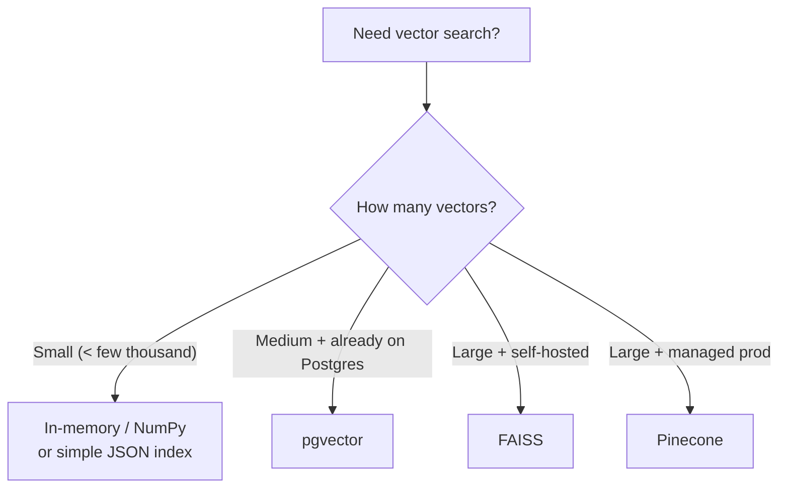

---

### 8. What we used 

**We did NOT use FAISS, Pinecone, or pgvector.**

We used:
- **Local JSON index** (`routing-index.json`)
- **In-memory NumPy cosine similarity** (brute-force over all vectors)
- **MiniLM embeddings** via fastembed
- Index loaded in the MCP server at query time

**Why that was enough:**
- Index size was **small** — hundreds of routing triggers, not millions of chunks
- System was **local-first** (engineer laptops)
- Search had to be **simple, offline, no external DB**
- Latency was still fine — brute force over ~few hundred vectors is milliseconds

**Flow we used:**
1. Load pre-built index from JSON
2. Embed query with MiniLM
3. Normalize vectors
4. Compute cosine similarity with matrix multiply (`vecs @ query_vec`)
5. Filter by threshold (0.44) and return top matches

---

### 9. When we would upgrade

| If this happened… | We’d consider… |
|-------------------|----------------|
| Index grows to **100K+ vectors** | FAISS or pgvector |
| Need **multi-user cloud RAG** | Pinecone or pgvector |
| Need **permissions/filters in SQL** | pgvector |
| Need **managed scale + low ops** | Pinecone |

---

### 10. Strong closing line

> "FAISS is best for **high-performance self-hosted search**, Pinecone for **managed production RAG at scale**, and pgvector when you want **vectors inside Postgres with SQL and metadata**. In KIRA, our index was only a few hundred entries and local-first, so we used a **simple in-memory NumPy cosine search over a JSON index** — no vector DB needed. I’d pick the tool based on **scale, ops capacity, and whether we already live on Postgres**."

---

**One-liner:**  
*"Small index → in-memory search; Postgres app → pgvector; huge self-hosted → FAISS; managed prod → Pinecone. We used in-memory NumPy because our routing index was small and local."*
---

# ROUND 3 — Cloud & Backend

---

## Q13. How Did You Use AWS S3, RDS, EKS Together in Your ETL Pipeline?

**Architecture:**
- Production error logs landed in **S3** as raw files
- **ETL pipeline** (Argo Workflows) picked up files on schedule
- Processed and transformed errors, stored structured records in **RDS** (PostgreSQL)
- From RDS, downstream jobs generated Jira tickets and Slack notifications
- Entire pipeline ran on **EKS** — containerized, scalable, Kubernetes-managed
- **GitHub Actions** handled CI/CD — build, test, deploy to EKS on merge

**Why this stack:**
- S3 for durable, cheap raw storage
- RDS for queryable structured data
- EKS for scalable, containerized pipeline execution

---

## Q14. Explain Your Argo Workflows Pipeline Architecture

**What Argo Workflows is:**
- Kubernetes-native workflow engine
- Each step runs as a container
- DAG-based — define dependencies between steps

**My pipeline:**
- Step 1: Fetch raw error logs from S3
- Step 2: Parse and classify errors by type
- Step 3: Deduplicate — don't create duplicate Jira tickets
- Step 4: Generate structured ticket payload
- Step 5: POST to Jira API, send Slack notification
- Entire DAG runs daily on cron schedule

**Benefits:**
- Each step is independent and retryable
- Failed step doesn't restart entire pipeline
- Full observability — each step has logs in Kubernetes


### 1. What Argo Workflows is in our platform

- **Argo Workflows** is our **Kubernetes-native orchestration engine** for heavy data jobs
- It runs **Spark, dbt, and custom container workloads** as a directed graph of steps
- We use it for **compute-intensive pipelines** — not for light scheduling or BI refresh
- **Airflow** handles some downstream orchestration; **Argo** handles the big distributed jobs

**Simple split:**
- **Argo** → run large data processing on Kubernetes
- **Airflow** → coordinate broader platform jobs and dependencies across systems

---

### 2. High-level platform flow

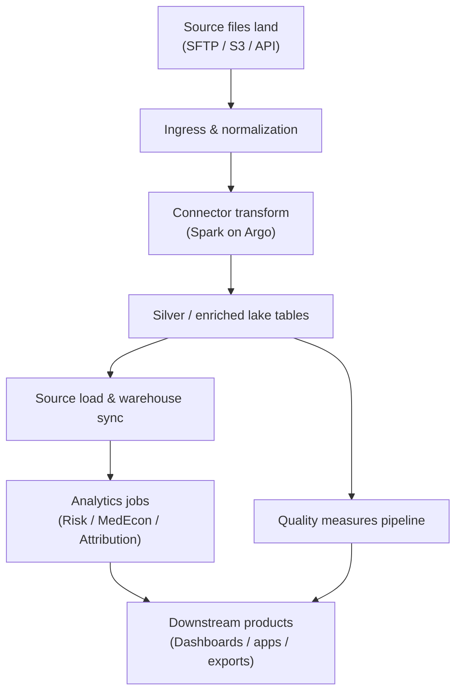

Argo sits in the **middle of the data platform** — after raw ingestion, before customer-facing outputs.

---

### 3. Main pipeline categories we run on Argo

| Pipeline type | What it does |
|---------------|--------------|
| **Connector pipelines** | Transform raw source files into standardized lake tables |
| **Analytics engines** | Risk scoring, medical economics, attribution on large datasets |
| **Measure engine jobs** | Clinical quality measure calculation (multi-stage workflow) |
| **Backfill / reprocessing** | Re-run historical data after code or config changes |
| **Release / ungating jobs** | Move data from gated to production-ready state |

Each category has **reusable workflow templates** — not one-off scripts every time.

---

### 4. Core architecture pattern

**Workflow Template → Workflow Instance → Steps → Pods**

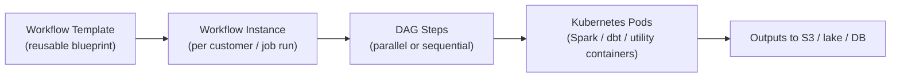

**Key ideas:**
- **Templates** define the standard job pattern
- Each run is an **instance** parameterized by customer, environment, source, version
- Steps form a **DAG** — some run in parallel, some must wait for upstream completion
- Each step launches **containers on Kubernetes** with defined CPU/memory

---

### 5. How jobs get triggered

**Three trigger modes:**

| Mode | Example |
|------|---------|
| **Event-driven** | New file lands → event chain → scheduling workflow submits connector job |
| **Scheduled** | Cron-based workflows for recurring measure runs or polling schedulers |
| **Manual / ops-triggered** | Engineer or ops bot submits workflow for reprocessing or backfill |

**Event-driven connector example (conceptually):**
1. File arrives in inbound storage
2. Event notification flows through queue and streaming layer
3. Scheduler compares **latest file time vs last workflow run**
4. If new data exists → submit connector workflow
5. After completion → update run metadata so same file isn’t reprocessed incorrectly

---

### 6. Connector pipeline architecture (most common Argo use case)

**Typical stages:**

1. **Ingress** — receive, validate, normalize incoming files  
2. **Extract** — parse source format into raw/bronze structures  
3. **Transform** — Spark job applies business rules → working silver tables  
4. **Enrich / publish** — apply availability gates, write final silver, sync to object store  
5. **Downstream load** — trigger warehouse sync and profile updates  

**Design choices:**
- **Per-customer, per-source isolation** — one bad source doesn’t block others
- **Label-based tracking** — workflows tagged with customer, source, environment
- **Idempotent partitions** — re-runs overwrite specific partitions, not whole datasets

---

### 7. Measure engine pipeline (multi-stage Argo design)

This is a good example of **complex orchestration**:

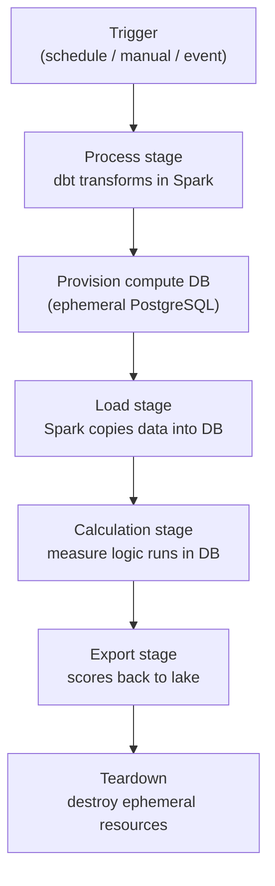

**Why this design:**
- Heavy prep happens in **Spark on the lake**
- Calculation happens in a **temporary database** sized for that job
- Resources are ** torn down after export** — cost-efficient, isolated per run
- Scheduler tracks **step history** so ops knows exactly where a job failed

---

### 8. Analytics pipelines (Risk / MedEcon / Attribution)

- These are **large Spark + dbt workflows** on the data lake
- Some customers run them **inside the warehouse nightly job**
- Others use **“excised” mode** — processing moves to the lake via Argo, then results load back
- Branching depends on **customer config flags**, not hardcoded logic

**Important dependency rules we enforce:**
- Attribution and risk can often run in parallel
- MedEcon may depend on attribution output
- Shared resources (like patient index jobs) require **staggering** to avoid contention
- Downstream export jobs wait until **all upstream lake jobs complete**

---

### 9. Configuration-driven pipeline graph

- We don’t hardcode one pipeline for every customer
- A **dependency graph** defines jobs, outputs, and conditions
- Per customer + environment, flags decide which branches apply:
  - Is analytics excised to the lake?
  - Does customer use dashboards, core web, quality apps?
  - Which sources are active?

**At runtime:**
1. Resolve customer/environment config
2. **Prune** the graph to only relevant jobs
3. Walk dependencies from the trigger point
4. Submit only what needs to re-run

This makes **reprocessing** safe — change one thing, rerun only affected downstream jobs.

---

### 10. Kubernetes integration

- Argo runs in a dedicated **workflow namespace** on the data processing cluster
- Each step = Kubernetes pod with:
  - Container image (Spark, dbt, utility)
  - Resource requests/limits (CPU, memory)
  - Service account / IAM role for S3 and internal APIs
- Failed pods are retained for debugging
- Child Spark driver/executor pods often run in separate namespaces

---

### 11. Observability and failure handling

**How we monitor:**
- Workflow UI/API for step-level status
- Centralized logs (pod logs + workflow archive)
- Job dashboards for long-running pipelines (especially measures)
- Step history in ops database for SLA tracking

**Common failure patterns:**
- **OOM** on Spark driver/executors — most frequent
- **Exit code failures** in dbt or validation scripts
- **Dependency timeouts** — upstream data not ready
- **Resource contention** — two heavy jobs hitting same shared service

**Triage approach:**
1. Identify workflow instance
2. Find failed step/node
3. Pull logs for that pod (not just parent workflow)
4. Classify: infra (OOM), data (validation), or config (wrong version/params)
5. Retry only from the step that actually needs re-running

---

### 12. How Argo fits with other orchestrators

| Tool | Role |
|------|------|
| **Argo Workflows** | Heavy compute on Kubernetes (Spark/dbt) |
| **Airflow** | Platform-level DAGs (exports, content refresh, automation) |
| **SQL Agent / nightly jobs** | Warehouse-side batch steps |
| **Streaming/event layer** | Detect new files and trigger connector workflows |
| **Ops automation** | Builds execution plans and submits approved job chains |

They work together — Argo is the **compute orchestration layer**, not the only scheduler.

---

### 13. Design principles we followed

- **Template reuse** — same workflow pattern across customers, different parameters
- **Explicit dependencies** — no hidden “hope upstream finished” logic
- **Config-driven branching** — customer differences via flags, not forked code
- **Failure isolation** — per-source/per-job boundaries
- **Observable steps** — every stage has status, logs, and retry semantics
- **Cost control** — ephemeral resources for heavy calculation jobs

---

### 14. Strong closing line

> "Our Argo architecture is a **Kubernetes-native DAG pipeline** for heavy data processing. Reusable workflow templates run connector transforms, analytics engines, and multi-stage measure jobs. Jobs are triggered by **events, schedules, or manual reprocessing**, with **config-driven dependency graphs** deciding what must rerun. Each step runs as a containerized Spark or dbt workload, outputs land in the lake or warehouse, and downstream orchestrators pick up from there. The key design is **modular templates + explicit dependencies + per-customer config branching** — so we can scale many customers without one monolithic pipeline."

---

**If they ask "your role specifically":**  
*"I worked on troubleshooting and understanding these workflows — identifying failed steps, tracing dependencies, and ensuring retrieval/orchestration layers connected ops to the right pipeline stage. I didn’t own the entire Argo platform, but I worked closely with how jobs were triggered, monitored, and re-run safely."*

---

## Q15. How Do You Secure an LLM API Endpoint in Production?

**Key layers:**

- **Authentication** — API key or OAuth token required on every request
- **Authorization** — role-based access, users only query permitted knowledge sources
- **Input validation** — sanitize and length-limit inputs before hitting LLM
- **Rate limiting** — prevent abuse, control cost
- **Output filtering** — strip PII or sensitive content from responses
- **Prompt injection protection** — detect and block attempts to override system prompt
- **Audit logging** — log every request, user, and response for compliance
- **Secrets management** — API keys in AWS Secrets Manager, never in code

**1. Authentication**
- Require **API keys, OAuth, or SSO** for every request
- Use **short-lived tokens** (not permanent keys in client apps)
- Rotate keys regularly; store in **secret manager**, never in code

**2. Authorization**
- **Role-based access** — who can call which models/tools
- Limit by **environment** (dev vs prod) and **user persona**
- Principle of least privilege — no broad admin tokens

**3. Network security**
- **Private/VPN-only** or internal network — not public internet
- **TLS everywhere** (HTTPS only)
- Restrict ingress with firewall / security groups / allowlists

**4. Rate limiting & quotas**
- Per-user and per-tenant **rate limits**
- **Token/cost budgets** to prevent abuse and runaway spend
- Block or throttle suspicious traffic patterns

**5. Input/output guardrails**
- Validate and sanitize **user input** (length, content, injection attempts)
- Filter **sensitive data** (PII/PHI) from prompts and responses
- Block prompt injection patterns where possible

**6. Logging & monitoring**
- Log requests **without storing secrets or full PHI**
- Monitor for anomalies: spike in usage, failed auth, unusual prompts
- Alert on cost spikes and error rates

**7. Model & tool access control**
- Restrict which **models** each client can use
- Gate **tool/MCP calls** behind authorization hooks
- Require confirmation for **destructive actions**

---

### Simple architecture

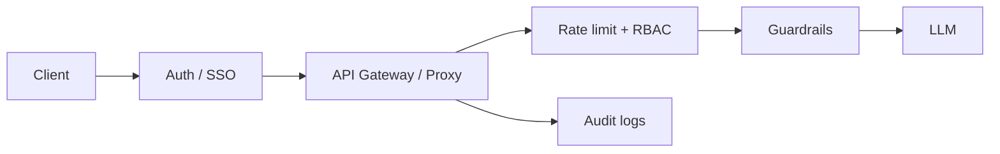

---

### What we did in practice

- **LiteLLM proxy** with per-user tokens from SSO identity
- **VPN-only** internal endpoint — not exposed publicly
- **Persona-based tool guardrails** before any action runs
- Secrets from **1Password / Secrets Manager**, injected at runtime

---

### Closing Statement

> "Secure an LLM API with **auth + RBAC + private network + rate limits + input/output guardrails + audit logging**. Never expose the model directly — always put a **proxy/gateway** in front with tokens, quotas, and policy enforcement."

---

**One-liner:**  
*"Authenticate every call, authorize by role, keep it off the public internet, rate-limit and budget tokens, filter sensitive data, and log everything safely."*
---
---

# ROUND 4 — System Design

---

## Q16. System Design — RAG Chatbot for 10,000 Concurrent Users

> Interview format: always follow this sequence — **Clarify → Estimate → Design → Deep Dive → Trade-offs.** Never jump straight to drawing components.

---

### Step 1: Clarify Requirements (ask these first — 2 minutes)

In an interview, ask before drawing anything. This shows structured thinking.

**Functional — ask the interviewer:**
- Is this internal (employees) or external (end-users / customers)?
- Does it need chat history / memory across turns within a session?
- Single tenant or multi-tenant — each company's data isolated?
- Is the document corpus static or continuously updated?
- Read-only Q&A, or does it also take actions (tool calls, form submission)?

**Non-functional — state your assumptions if not given:**
- 10,000 concurrent users (not 10,000 RPS — always clarify this distinction)
- Response latency: under 5 seconds is acceptable for AI-generated answers
- 99.9% availability
- No cross-tenant data leakage
- PII must not be stored raw in logs or vector indexes

---

### Step 2: Estimate Scale (do this out loud — it demonstrates systems thinking)

- 10K concurrent users → assume 1 question every 30 seconds per user → **~330 QPS at peak**
- With 50% semantic cache hit rate → **~165 QPS actually hit the LLM**
- Each LLM call: 1–3 seconds → need ~150–500 parallel inference slots at the gateway
- **Cost sanity check:** 165 QPS × $0.01/call × 86,400s = **~$140K/day uncached** — caching is not optional, it is the primary cost lever at this scale
- Vector DB storage: 10M chunks × 384 dimensions = ~15GB — manageable in a managed service
- Chat history: 10K users × 10 messages × 500 tokens = ~50M tokens stored per day

**Key insight from the math:** LLM cost and inference throughput are the bottleneck — not app servers or storage. Design around that first.

---

### Step 3: High-level Design

> Speak this opening sentence, then draw the diagram:

"I'd design this as a **horizontally scalable, stateless API layer** in front of a **RAG pipeline** and an **LLM gateway**. At 10,000 concurrent users the bottleneck is **retrieval latency, LLM throughput, and cost** — not the chat UI. The key moves are **caching, async processing, streaming responses, and per-user rate limits**."

---

### Step 3a: Architecture Diagram

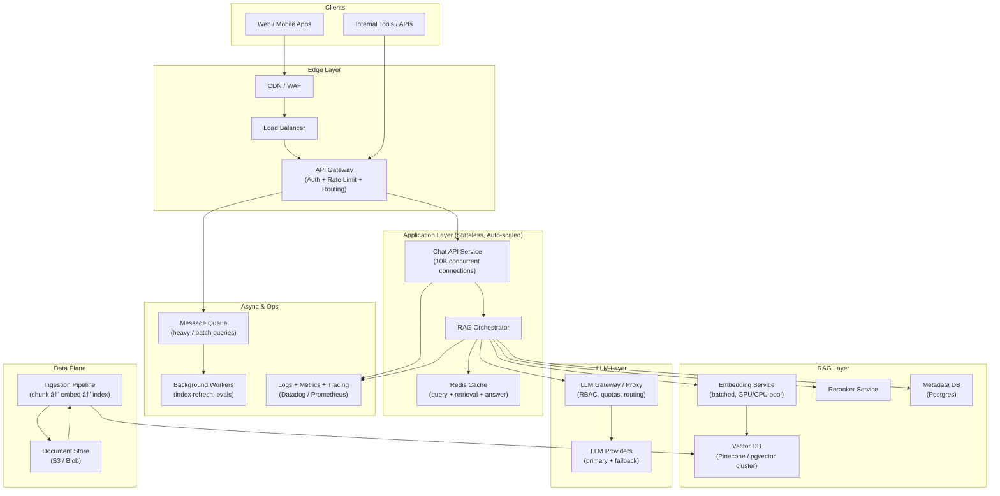

---

### Step 3b: Request Flow

```mermaid
sequenceDiagram
    participant U as User
    participant G as API Gateway
    participant C as Chat Service
    participant R as Redis Cache
    participant E as Embedding Service
    participant V as Vector DB
    participant L as LLM Gateway
    participant M as LLM

    U->>G: Ask question (JWT/API key)
    G->>G: Auth + rate limit + tenant check
    G->>C: Forward request
    C->>R: Check semantic cache
    alt Cache hit
        R-->>C: Cached answer
        C-->>U: Stream response
    else Cache miss
        C->>E: Embed query
        E->>V: Top-K retrieval (+ metadata filter)
        V-->>C: Relevant chunks
        C->>C: Rerank + build prompt
        C->>L: Send prompt (stream=true)
        L->>M: Model inference
        M-->>L: Token stream
        L-->>C: Stream tokens
        C-->>U: Stream response (SSE/WebSocket)
        C->>R: Cache final answer
    end
```

---

### How I’d handle 10K concurrency (theory to speak)

**1. Stateless app tier**
- Chat API and RAG orchestrator run as **stateless pods**
- Scale with **HPA** on CPU, memory, and request queue depth
- Session/chat history in **Redis or Postgres**, not in app memory

**2. Streaming first**
- Don’t wait for full LLM response — use **SSE or WebSocket**
- Improves perceived latency and keeps connections efficient

**3. Caching at 3 levels**
- **Exact query cache** — same question → same answer (short TTL)
- **Retrieval cache** — same embedding → same top chunks
- **Prompt/answer cache** — for FAQ-heavy traffic  
- This cuts LLM cost dramatically at scale

**4. Retrieval optimized for scale**
- At 10K users, index is likely **millions of chunks**
- Use **managed vector DB** (Pinecone) or **pgvector with read replicas**
- Add **metadata filters** first (tenant, product, date) → then vector search
- Use **reranker** only on top 20–50 candidates, not full corpus

**5. LLM gateway in front**
- Single internal proxy for all model calls
- Handles:
  - **Auth / RBAC**
  - **Rate limits per user/tenant**
  - **Token budgets**
  - **Model routing** (cheap model for simple queries, strong model for complex ones)
  - **Fallback model** if primary is slow/down

**6. Queue heavy requests**
- Simple FAQ → real-time path
- Long doc analysis / multi-step agent tasks → **async queue**
- User gets job ID, polls or gets notified when done

**7. Multi-tenant isolation**
- Separate **namespaces/index partitions per tenant**
- Row-level or metadata-level ACL filtering during retrieval
- Prevent cross-tenant data leakage

**8. Ingestion off the hot path**
- Document upload/chunk/embed/index runs in **background workers**
- Use **blue-green index swap** so retrieval never hits half-built index

**9. Observability**
- Track:
  - p95 latency (retrieval vs generation)
  - cache hit rate
  - token cost per tenant
  - retrieval recall on golden test set
  - hallucination/escalation rate
- Auto-alert on cost spikes and error bursts

**10. Security (production must-haves)**
- Auth at gateway
- Private network / VPC
- PII redaction before embedding and before logging
- Guardrails on output
- Audit logs without storing raw secrets

---

### Capacity thinking (show you’ve done the math)

"10,000 concurrent users doesn’t mean 10,000 LLM calls per second. If each user sends ~1 question every 30 seconds, that’s roughly **300–350 QPS**. With caching, maybe only **30–50%** hit the LLM. So I’d design for ~**100–150 true LLM QPS**, with autoscaling and queue buffering for bursts."

---

### Component Choices at This Scale

| Component | Choice at this scale |
|-----------|----------------------|
| Vector DB | Pinecone or pgvector cluster with replicas |
| Cache | Redis cluster |
| Chat API | Kubernetes + HPA |
| LLM access | Internal proxy (LiteLLM-style gateway) |
| Ingestion | Async workers + atomic index swap |
| Transport | SSE/WebSocket for streaming |

---

### Step 5: Trade-offs

- **Cost vs quality** — route simple queries to smaller/cheaper models
- **Latency vs accuracy** — smaller top-K + reranker vs larger context
- **Freshness vs stability** — frequent index rebuilds vs cached retrieval
- **Sync vs async** — real-time chat vs background for heavy jobs

---

### Closing Statement (20 seconds)

> "I’d put a **stateless, autoscaling chat layer** in front of a **cached RAG pipeline** and an **LLM gateway**. Retrieval would be tenant-aware and filtered, generation would stream back to the user, and heavy jobs would go async. For 10K concurrent users, the winning design is **caching + streaming + rate limits + observability** — not just throwing a bigger model at the problem."

---

Want a **follow-up Q&A** for likely probes: *"Why not fine-tune?"*, *"How to prevent hallucinations?"*, *"How to estimate cost?"*
---

## Q17. System Design — Scale an AI Platform to 250,000 Users

> Same interview structure: **Clarify → Estimate → What breaks → How to fix → Trade-offs.**

---

### Step 1: Clarify Requirements

Before answering "what breaks", confirm the scenario. This matters.

**Ask or state:**
- 250K total registered users, or 250K simultaneous? (Almost always registered — clarify)
- What kind of platform — RAG chatbot, agentic assistant, code helper?
- Multi-tenant (each company isolated) or single-tenant?
- Global traffic or single region?
- Any hard SLAs — latency, uptime, cost per query?

**Assumed for this answer:**
- 250K registered users with normal usage patterns (not all online at once)
- Peak concurrency ~5–10% = **12K–25K concurrent users**
- ~1 query per 30 seconds per active user → **400–800 QPS at peak**
- Multi-tenant RAG chatbot with document retrieval and LLM generation
- Target: <5s latency, 99.9% uptime

---

### Step 2: Estimate Scale

- 250K users, 10% peak active = 25K concurrent
- 25K users × 1 query/30s = **~830 QPS**
- 50% cache hit → **~415 QPS to LLM**
- At $0.01/call: 415 × 86,400 = **~$360K/day uncached** — caching and model routing are existential, not optional
- Chat history at scale: 250K users × 20 msgs × 500 tokens = **2.5 billion tokens/day in DB**
- Vector index: if multi-tenant, assume 10M chunks per large tenant, dozens of tenants → **index sharding is required**

---

### Step 3: How to Open Your Answer

"First I’d clarify: **250K users** usually means registered users, not 250K simultaneous requests. But even with normal usage patterns, the first things to break in an AI platform are almost always **LLM cost/throughput**, then **retrieval latency**, then **session/history storage** — not the frontend."

---

### Step 2 Recap: Assumptions

- **250K total users**
- Assume **5–10% peak online** → ~**12K–25K concurrent**
- Assume **1 query every 20–40 seconds** at peak
- That can mean roughly **300–1,000+ QPS** at peak if uncached

---

### Step 4: What Breaks First and Why

```mermaid
flowchart TD
    A["250K Users"] --> B["1. LLM Gateway\nCost + Rate Limits"]
    B --> C["2. Retrieval Layer\nVector DB + Embeddings"]
    C --> D["3. Cache Layer\nRedis saturation / low hit rate"]
    D --> E["4. Chat History DB\nRead/write pressure"]
    E --> F["5. Auth / Tenant RBAC\nToken + policy checks"]
    F --> G["6. Observability\nLogs/traces cost + noise"]
    G --> H["7. Ingestion / Index Freshness\nStale or slow rebuilds"]
```

| Order | What breaks | Why |
|-------|-------------|-----|
| **1** | **LLM layer** | Every uncached query = expensive inference + provider rate limits |
| **2** | **Retrieval** | Vector search + embedding latency grows with corpus and QPS |
| **3** | **Cache** | Without good cache strategy, cost and latency explode |
| **4** | **Session DB** | Chat history reads/writes become hot path |
| **5** | **Auth/guardrails** | Per-request policy checks add latency at scale |
| **6** | **Observability** | Logging full prompts/responses becomes too expensive |
| **7** | **Knowledge freshness** | Index updates lag behind document changes |

---

### Step 4a: Architecture Under Stress

```mermaid
flowchart TB
    subgraph users ["250K Users"]
        U["Peak traffic burst"]
    end

    subgraph edge ["Edge - usually OK if stateless"]
        LB["Load Balancer"]
        GW["API Gateway\nAuth + Rate Limit"]
    end

    subgraph hot ["First Hotspots"]
        REDIS["Redis Cache\nâš  breaks if hit rate low"]
        EMB["Embedding Service\nâš  queue buildup"]
        VDB["Vector DB\nâš  p95 latency spikes"]
        LLM["LLM Gateway\nâš  cost + provider limits"]
    end

    subgraph warm ["Second Wave Failures"]
        PG["Postgres\nchat history / metadata"]
        AUDIT["Audit + Logs\nâš  volume + cost"]
        ING["Ingestion Workers\nâš  stale knowledge"]
    end

    subgraph control ["Control Plane"]
        RL["Rate limits / quotas"]
        ROUTE["Model routing\ncheap vs strong"]
        OBS["Metrics + alerts"]
    end

    U --> LB --> GW
    GW --> REDIS
    GW --> EMB --> VDB
    GW --> LLM
    GW --> PG
    GW --> AUDIT
    RL --> GW
    ROUTE --> LLM
    OBS --> GW
    OBS --> LLM
    OBS --> VDB
    ING --> VDB
```

---

### Step 4b: The Story to Speak

#### 1. LLM cost and throughput breaks first

"At 250K users, the **LLM bill** becomes the first real problem — not servers.

Even modest usage adds up fast:
- 250K users × a few queries/day = **millions of tokens/day**
- Uncached RAG makes it worse because every answer sends **retrieved chunks + history + system prompt**

What breaks:
- **Provider rate limits**
- **Queueing/timeouts**
- **Budget overruns**

**Fix:**
- LLM **gateway with quotas**
- **Semantic + exact caching**
- **Model routing** — small model for simple queries, large model only when needed
- **Token budgets per user/tenant**
- **Async queue** for heavy jobs"

---

#### 2. Retrieval breaks second

"Once LLM is partially controlled, **RAG retrieval** becomes the next bottleneck.

What breaks:
- Embedding service queue grows
- Vector DB p95 latency jumps
- Too many chunks returned → huge prompts → slower + costlier LLM calls

**Fix:**
- Metadata filter first, vector search second
- Top-K small (5–10), then rerank
- Separate indexes per tenant/domain
- Read replicas / managed vector service
- Precompute embeddings for common queries where possible"

---

#### 3. Cache stops helping if designed badly

"Without caching, 250K users will crush the platform.

What breaks:
- Redis memory pressure
- Low cache hit rate because queries are slightly different every time
- Stale answers if TTL is wrong

**Fix:**
- 3-level cache: query, retrieval, answer
- Semantic cache for near-duplicate questions
- Shorter TTL for fast-changing docs
- Cache only after guardrail validation"

---

#### 4. Chat history / session storage starts hurting

"People forget this — AI platforms are also **database-heavy apps**.

What breaks:
- Postgres read/write hot spots
- Long conversation history sent to LLM every turn
- Storage cost for messages + audit logs

**Fix:**
- Store history in scalable DB (Postgres + read replicas, or sharded store)
- **Summarize old turns** instead of sending full history
- Pagination + retention policy
- Separate hot session store (Redis) from cold archive"

---

#### 5. Auth, RBAC, and guardrails add latency

"At low scale, security hooks feel free. At 250K users, they become part of perf design.

What breaks:
- Per-request auth validation
- Tool permission checks
- PII redaction on every message
- Policy engine becoming synchronous bottleneck

**Fix:**
- Cache user permissions/session claims
- Move heavy checks async where possible
- Fail closed, but keep checks lightweight
- Batch audit logging"

---

#### 6. Observability itself can break

"Logging every prompt/response at 250K users becomes expensive and slow.

What breaks:
- Log volume/cost
- Trace cardinality
- On-call noise — too many alerts

**Fix:**
- Sample traces, full logs only for failures
- Redact PII before logging
- Track golden metrics:
  - p95 latency
  - cache hit rate
  - cost per active user
  - retrieval recall
  - escalation rate"

---

#### 7. Knowledge freshness and ops complexity break last — but hurt trust

"What breaks is not uptime — it's **answer quality**.

What breaks:
- Stale vector index
- Partial index rebuilds
- Tenant docs out of sync
- No regression evals after KB changes

**Fix:**
- Async ingestion pipeline
- Versioned indexes + atomic swap
- Continuous offline eval on golden questions
- Canary release for retrieval changes"

---

### Step 4c: Failure Timeline

```mermaid
gantt
    title What Breaks as User Scale Increases
    dateFormat X
    axisFormat %s

    section Cost
    LLM spend spikes           :0, 1
    Token quotas required      :1, 2

    section Performance
    Retrieval latency rises    :1, 3
    Cache miss storm           :2, 4
    Session DB pressure        :3, 5

    section Reliability
    Provider rate limits       :2, 4
    Queue backlog              :3, 5

    section Quality
    Stale knowledge index      :4, 6
    Hallucinations increase    :4, 6
```

---

### What Does NOT Break First

- Frontend/UI scaling — usually easy with CDN + static assets
- Basic API gateway — scales horizontally fine
- Stateless chat service pods — Kubernetes HPA handles this

---

### Scaling plan (what I’d do before hitting 250K)

```mermaid
flowchart LR
    A["Phase 1\nLLM gateway + quotas"] --> B["Phase 2\nCaching + model routing"]
    B --> C["Phase 3\nRetrieval optimization"]
    C --> D["Phase 4\nSession/history scaling"]
    D --> E["Phase 5\nEval + index versioning"]
```

1. **Phase 1** — LLM proxy, auth, per-tenant budgets  
2. **Phase 2** — Redis caching + cheap/strong model routing  
3. **Phase 3** — Vector DB tuning, reranking, tenant filters  
4. **Phase 4** — History summarization + DB scaling  
5. **Phase 5** — Automated RAG evals + safe index refresh  

---

### Closing Statement

> "At 250K users, **LLM cost and inference throughput break first**, then **retrieval and cache effectiveness**, then **chat history storage and observability**. The platform doesn’t usually die from traffic — it dies from **uncached LLM calls, slow vector search, and stale knowledge**. So I’d scale with a gateway, aggressive caching, tenant-aware retrieval, async heavy jobs, and continuous evals."

---

**One-liner if short on time:**  
*"LLM cost/rate limits first, vector retrieval second, cache/history third, freshness/trust last."*

---

## Q18. How Would You Build an Agentic Workflow System With Tool Calling?

**Core components:**

- **Orchestrator** — LLM that decides which tool to call and in what order
- **Tool registry** — catalog of available tools with schemas (MCP)
- **Tool executor** — safely runs tool calls, handles errors, returns results
- **Memory** — short-term (conversation), long-term (vector store)
- **Guardrails** — validate tool inputs/outputs, prevent harmful actions

**Flow:**
```
User query → Orchestrator LLM
  → Thinks: what tools do I need?
  → Calls Tool 1 (e.g. search docs)
  → Gets result → decides next step
  → Calls Tool 2 (e.g. query DB)
  → Synthesizes final answer → returns to user
```

**What I built at CitiusTech:**
- Used FastMCP to expose Jira, Git, AWS as tools
- LLM routed queries to correct tool based on intent
- Knowledge routing pipeline ensured LLM always grounded in correct source

### 1. What an agentic workflow system is

- An **agent** is an LLM that can **plan, decide, and act** — not just answer text
- **Tool calling** lets the agent invoke external capabilities: search, APIs, databases, file read, ticket create, etc.
- An **agentic workflow** chains those decisions into a repeatable process:
  - understand goal → choose tool → observe result → next step → final answer

**One-line definition:**  
> "LLM as orchestrator, tools as hands."

---

### 2. High-level architecture

```mermaid
flowchart TB
    subgraph user ["User Layer"]
        U["User / API / Slack / Ticket"]
    end

    subgraph agent ["Agent Layer"]
        ORCH["Agent Orchestrator"]
        PLAN["Planner / Reasoner"]
        MEM["Session Memory\n(short + summarized history)"]
        POL["Policy Engine\n(guardrails + permissions)"]
    end

    subgraph tools ["Tool Layer"]
        REG["Tool Registry"]
        MCP["MCP / Tool Servers"]
        T1["Search / RAG"]
        T2["Jira / Slack / Email"]
        T3["DB / AWS / Internal APIs"]
        T4["Code / File / Script tools"]
    end

    subgraph control ["Control Plane"]
        AUTH["Auth + RBAC"]
        RL["Rate limits / quotas"]
        AUDIT["Audit logs"]
        EVAL["Eval + tracing"]
    end

    U --> ORCH
    ORCH --> PLAN
    ORCH --> MEM
    ORCH --> POL
    PLAN --> REG
    REG --> MCP
    MCP --> T1
    MCP --> T2
    MCP --> T3
    MCP --> T4
    POL --> REG
    AUTH --> ORCH
    RL --> ORCH
    ORCH --> AUDIT
    ORCH --> EVAL
```

---

### 3. Core components to build

| Component | Purpose |
|-----------|---------|
| **Orchestrator** | Runs the agent loop, manages state, handles retries |
| **Tool registry** | Defines available tools, schemas, descriptions |
| **Policy/guardrails** | Approves or blocks tool calls by role/environment |
| **Memory** | Keeps conversation + intermediate results |
| **RAG/KB layer** | Grounds the agent before action |
| **Observability** | Traces every tool call, latency, cost, outcome |
| **Eval harness** | Tests agent behavior on golden scenarios |

---

### 4. Agent loop (the heart of the system)

```mermaid
sequenceDiagram
    participant U as User
    participant A as Agent Orchestrator
    participant K as Knowledge Search
    participant P as Policy Hook
    participant T as Tool
    participant L as LLM

    U->>A: Goal / question
    A->>K: Retrieve relevant context first
    K-->>A: Knowledge cards / docs
    A->>L: Prompt + context + tool schemas
    L-->>A: Decide next action (tool call or answer)
    A->>P: Authorize tool call
    alt Allowed
        P-->>A: Allow
        A->>T: Execute tool
        T-->>A: Tool result
        A->>L: Result + updated state
        L-->>A: Next step or final answer
        A-->>U: Response
    else Denied
        P-->>A: Block
        A-->>U: Safe fallback / ask user
    end
```

**Speak this clearly:**
- Agent does **not** jump straight to tools
- It first gets **grounding context**
- Then enters a loop: **think → tool → observe → think → answer**

---

### 5. How I’d design tool calling

**Step 1 — Define tools properly**
- Each tool needs:
  - Clear name
  - Description (when to use / when not to use)
  - Input schema (typed parameters)
  - Output format
- Bad tool descriptions = bad agent behavior

**Step 2 — Expose tools via a standard protocol**
- Use **MCP** or similar standard so tools are modular
- Examples:
  - Knowledge search tool
  - Ticket lookup tool
  - Database query tool
  - Notification tool

**Step 3 — Enforce tool order with rules**
- Example rule: **search knowledge before any destructive action**
- Some tools are **read-only**, some require **confirmation**
- Some are blocked in production for certain roles

**Step 4 — Keep orchestration stateless where possible**
- Store session state in Redis/DB
- Each turn: context + tool history + latest observation

---

### 6. Workflow patterns I’d support

**Pattern A — Single agent, multi-tool**
- One agent handles the full task
- Good for support/investigation workflows

**Pattern B — Planner + specialist sub-agents**
- Main agent plans
- Sub-agents handle domains (logs, database, docs)
- Main agent merges results

```mermaid
flowchart LR
    A["Main Agent"] --> B["Logs Sub-agent"]
    A --> C["DB Sub-agent"]
    A --> D["Docs Sub-agent"]
    B --> A
    C --> A
    D --> A
    A --> E["Final answer"]
```

**Pattern C — Deterministic workflow + agent reasoning**
- Fixed steps for known SOPs
- Agent only for ambiguous decision points
- Best for enterprise reliability

---

### 7. Guardrails (must-have in production)

| Guardrail | Why |
|-----------|-----|
| **RBAC by persona** | Viewer vs engineer vs admin |
| **Environment checks** | Block prod writes for lower roles |
| **Confirmation gates** | Delete/write/send actions need approval |
| **Tool allow/deny lists** | Restrict dangerous capabilities |
| **Input validation** | Prevent injection into tools/APIs |
| **Output filtering** | Redact secrets/PII |

**Important principle:**  
> Never trust the model to self-police — enforce policy **before** tool execution.

---

### 8. Memory design

**Short-term memory**
- Current conversation
- Last few tool outputs

**Working memory**
- Structured state: customer, ticket ID, hypothesis, completed steps

**Long-term memory (optional)**
- Past resolved incidents
- User preferences
- Only store what’s safe and useful

**Key trick:** summarize old turns so context window doesn’t explode.

---

### 9. Reliability features

- **Retries with backoff** for transient tool failures
- **Timeouts** per tool
- **Circuit breakers** if external API is down
- **Idempotent tools** where possible
- **Human-in-the-loop** for high-risk actions
- **Max step limit** to prevent infinite agent loops

Example rule: stop after 10 tool calls and ask user for direction.

---

### 10. Observability and evals

**Trace every run:**
- User query
- Tool call sequence
- Retrieved knowledge
- Latency per tool
- Token cost
- Final outcome

**Eval scenarios:**
- Did agent call knowledge search first?
- Did it load the right context?
- Did it reach correct root cause?
- Did it avoid unauthorized tools?

```mermaid
flowchart LR
    A["Agent run"] --> B["Trace log"]
    B --> C["Automated gates"]
    B --> D["LLM critic / judge"]
    C --> E["Pass / Fail"]
    D --> E
    E --> F["Regression suite"]
```

---

### 11. Example enterprise workflow

**Use case:** "Investigate why customer data is missing"

1. User submits question  
2. Agent searches internal knowledge base  
3. Agent checks ticket/system metadata  
4. Agent queries data pipeline status  
5. Agent pulls relevant logs  
6. Agent identifies likely root cause  
7. Agent drafts resolution + internal comment  
8. Human approves before posting/updating anything critical  

This is agentic because the path is **dynamic**, not a fixed script.

---

### 12. Tech stack I’d choose

| Layer | Example choice |
|-------|----------------|
| LLM | Claude/GPT via internal proxy |
| Tool protocol | MCP |
| Orchestrator | Python service or agent framework |
| Memory | Redis + Postgres |
| RAG | Vector search + curated playbooks |
| Auth | SSO + RBAC |
| Observability | OpenTelemetry + structured traces |
| Evals | Mock tools + LLM-as-judge |

---

### 13. Common mistakes to avoid

- Too many tools → agent gets confused
- Vague tool descriptions → wrong tool selection
- No guardrails → dangerous production actions
- No evals → regressions go unnoticed
- Sending full chat history every turn → cost/latency blowup
- Letting agent hit production APIs without mocks in testing

---

### 14. What I’d build in phases

```mermaid
flowchart LR
    P1["Phase 1\nSingle agent + 3–5 read-only tools"] --> P2["Phase 2\nRAG grounding + guardrails"]
    P2 --> P3["Phase 3\nSub-agents + approvals"]
    P3 --> P4["Phase 4\nEvals + production observability"]
```

1. **Phase 1** — one agent, read-only tools, manual testing  
2. **Phase 2** — RAG first, RBAC, audit logs  
3. **Phase 3** — sub-agents, write tools with confirmation  
4. **Phase 4** — automated evals, cost controls, regression suite  

---

### 15. Tie to my experience (short, honest)

"In our enterprise AI assistant, we built this pattern practically:
- **MCP-based tools** for knowledge search and integrations
- Hard rule to **retrieve context before acting**
- **Persona guardrails** before tool execution
- **Eval framework** to verify tool order and investigation quality

So my approach is: **grounded agent + standard tool protocol + policy hooks + tracing/evals**."

---

### Closing Statement

> "I’d build an agentic workflow as a **grounded orchestration loop**: the agent retrieves context first, chooses tools through a standard registry like MCP, executes only after policy approval, and repeats until the goal is met. Production success depends less on the model and more on **tool design, guardrails, memory management, and evals**."

---

**One-liner:**  
*"Agent orchestrator + MCP tools + RBAC guardrails + RAG grounding + traced eval loop."*

---
## Q19 How KIRA session is tracked

KIRA does **not** use a central server session. It uses **local files + Claude Code’s session ID**.

```mermaid
flowchart TB
    A["Claude Code assigns session_id"] --> B["session_start hook"]
    B --> C["Write ~/.KIRA/state/{session_id}.json\npersona, environment, identity"]
    C --> D["Every tool call → pre_tool_use hook"]
    D --> E["Reads same session file by session_id"]
    E --> F["Applies guardrails / persona"]
```

### What gets stored per session

| What | Where | Purpose |
|------|--------|---------|
| **Persona / env / identity** | `~/.KIRA/state/{session_id}.json` | Guardrails (viewer, engineer, etc.) |
| **Bulk write counter** | `~/.KIRA-counters/KIRA-persona-{session_id}.count` | Rate-limit bulk ops per session |
| **search_kb dedup** | In-memory in MCP server process | Don’t repeat same knowledge cards |
| **LiteLLM token** | Env var at launch | LLM auth (~24h) — **not** in session file |
| **AWS SSO creds** | `~/.aws/sso/cache/` | AWS access — **separate** from KIRA session file |

**Key point:** Hooks share state via **files**, because hook subprocesses don’t reliably inherit env from `session_start`.

---

## How it “expires” (there are several layers)

### 1. Live session (when you’re using KIRA)
- Starts: when you run `KIRA` / Claude Code starts → `session_start` runs  
- Tracked by: Claude `session_id` + local state file  
- Ends: when you **exit/close** Claude Code (or kill the process)  
- **No active timer** on the persona file while you’re working

### 2. Session state file cleanup (housekeeping)
- On each new `session_start`, KIRA sweeps `~/.KIRA/state/`  
- Deletes files **older than 24 hours** (by file modification time)  
- Handles crashes/kill -9 where session never cleaned up manually

### 3. LiteLLM token (~24 hours)
- Fetched once at **`KIRA` launch**  
- **Expires after ~1 day**  
- **Not refreshed** mid-session by hooks  
- When expired → LLM calls fail (401) → **restart `KIRA`**

### 4. AWS SSO (separate expiry)
- Stored in AWS SSO cache with its own `expiresAt`  
- **Not fixed at 24h** — depends on SSO config  
- When expired → AWS/kubectl tools fail → **`aws sso login`**  
- `pre_tool_use` can **upgrade persona** on next tool call if you re-login mid-session

### 5. Other cleanup
- Bulk counters: removed after **7 days**  
- MCP dedup memory: gone when **MCP process dies** (session end)

---

## Timeline diagram

```mermaid
gantt
    title KIRA Session Lifecycles (independent)
    dateFormat X
    axisFormat %s

    section Agent session
    Claude Code session (local)     :0, 8
    State file on disk              :0, 9

    section Auth
    LiteLLM token (~24h)            :0, 10
    AWS SSO token (varies)          :0, 7

    section Cleanup
    State file swept if >24h old    :9, 10
```

---

## Simple speakable answer

> "KIRA tracks session locally using Claude Code’s `session_id`. At startup, `session_start` writes persona and environment to a JSON file under `~/.KIRA/state/`. Every tool call reads that file in `pre_tool_use`. The session effectively ends when you close Claude Code. The state file isn’t timed out during use — old files are cleaned up after 24 hours. LiteLLM auth (~24h) and AWS SSO expiry are separate — if either expires, you refresh that auth or restart `KIRA`; they’re not one unified session."

---

## One-line summary

**Tracked:** local file keyed by Claude `session_id`  
**Expires:** agent session on exit; state files after 24h cleanup; LiteLLM ~24h; AWS SSO on its own schedule  

**Not true:** one single 24h session object that covers everything.

# ROUND 5 — Behavioral

---

## Q19. AI Output Was Wrong in Production — How Did You Handle It?

**Say this:**

"In our RAG system, the LLM started returning responses that mixed content from two different knowledge domains — engineering specs and operational docs — because chunk boundaries were causing retrieval overlap.

What I did:
- First, added metadata filtering to scope retrieval by domain tag
- Added a faithfulness check — automated test that flags responses citing chunks from wrong domain
- Improved chunking at semantic boundaries, not fixed token counts
- Added regression test to catch this class of error going forward

Key learning: RAG failures are usually retrieval failures, not LLM failures. Fix the retrieval first."

"In production, we noticed the assistant sometimes gave incorrect guidance — usually because it retrieved the wrong knowledge or skipped the proper lookup step.

**What I did:**
1. **Didn’t panic or blame the model** — treated it as a system issue, not a one-off mistake  
2. **Reproduced the issue** with the same user query and traced where it went wrong  
3. Found the root cause was often **bad retrieval or missing context**, not the LLM itself  
4. **Fixed it quickly** — updated routing rules, tightened prompts, and added a check so knowledge search happens first  
5. **Added regression tests** so the same wrong answer wouldn’t come back after the next release  

**Result:** fewer repeat mistakes, more trust from users, and a clearer process — investigate → fix root cause → prevent recurrence, not just patch one bad answer."

---

**Even shorter (3 sentences):**

"We had cases where the assistant gave wrong answers in production. I reproduced the issue, found it was usually a retrieval/context problem, fixed the routing and prompt rules, and added regression checks so it wouldn’t happen again. The key was treating it as a pipeline issue and putting guardrails in place, not just correcting one response."

---

**Tip:** Sound calm, ownership-focused, and process-driven — interviewers want to see **debug → fix → prevent**, not "the model hallucinated."
---

## Q20. How Do You Stay Current With GenAI?

**Say this:**

"I follow a few things actively:

- **MCP ecosystem** — I've been tracking protocol updates and new server implementations since I work with FastMCP daily
- **Agentic frameworks** — LangGraph, CrewAI, and how multi-agent orchestration is evolving
- **Applied papers** — RAGAS evaluation paper, HyDE (Hypothetical Document Embeddings) for better retrieval
- **Practical sources** — Simon Willison's blog, Hugging Face releases, LlamaIndex changelog

Most recently I've been looking at how agentic memory works — combining short-term session memory with long-term vector retrieval — which is directly relevant to this role."
## Q20. How Do You Stay Current With GenAI?
---

"I stay current in three ways: **build, learn, and apply**.

First, I learn best by **working on real systems** — RAG, agents, MCP, evals — because that forces me to understand what actually works in production, not just what looks good in demos.

Second, I follow **trusted sources** regularly: official docs from major model providers, engineering blogs, and papers/posts on retrieval, agents, and LLM ops. I don’t chase every new tool — I focus on things relevant to my work, like better retrieval, tool calling, and evaluation.

Third, I **experiment in small POCs** — try a new embedding approach, test an agent pattern, or run evals on a change before adopting it in production.

For me, staying current isn’t about knowing every new model name — it’s about understanding **what’s production-ready**, what’s hype, and what solves real problems for users."

---

**Even shorter version:**

"I stay current by combining hands-on work with focused learning. I build and test GenAI features in real projects, follow key provider docs and strong engineering content, and run small experiments before adopting anything new. That helps me separate useful advances from hype and apply only what improves reliability, cost, or user experience."

---

**Tip if they ask for examples:** mention reading release notes, trying new retrieval/agent patterns in side experiments, and learning from production incidents — that sounds practical, not buzzword-heavy.

---
