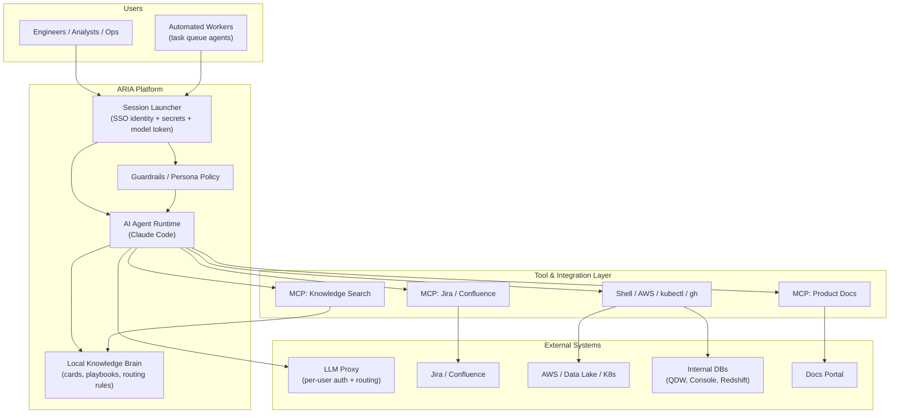
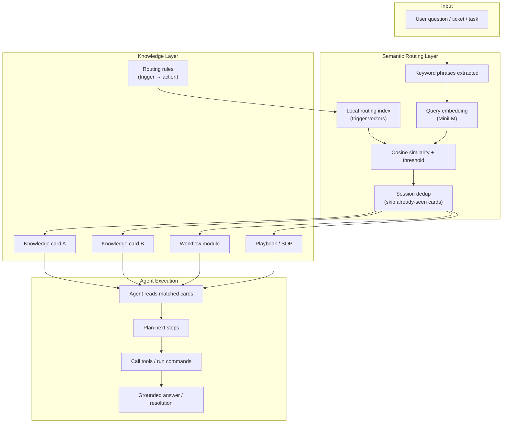
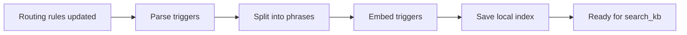
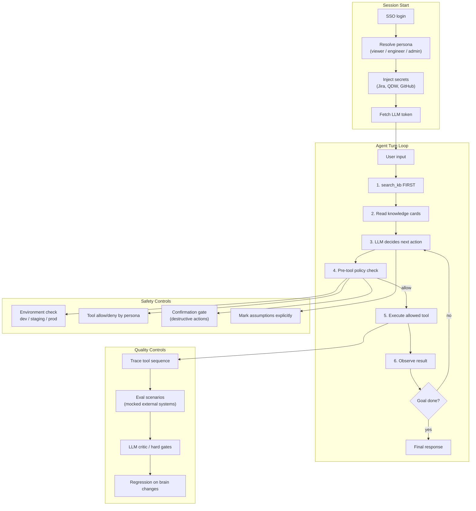
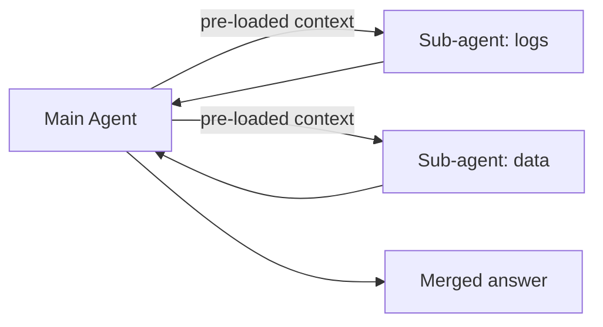

Here are **3 architectural views of ARIA** — each answers a different systems-thinking question.

---

## Diagram 1 — System Context (What is ARIA in the bigger picture?)

**Question it answers:** *Who uses it, what does it connect to, and where are the boundaries?*

**Systems thinking takeaway:**
- ARIA is **not just an LLM chatbot** — it is an **orchestrated agent platform**
- The **brain stays local** (versioned, reviewable knowledge)
- The **LLM is behind a proxy** (auth, cost, routing)
- **Tools are the action layer**; the model is the reasoning layer
- **Guardrails sit between intent and action**

---

## Diagram 2 — RAG & Knowledge Routing (How does ARIA stay grounded?)

**Question it answers:** *How does a user question become the right playbook before the agent acts?*

**Index build (offline path):**

**Systems thinking takeaway:**
- ARIA uses **routing RAG**, not “dump whole wiki into prompt”
- Flow is: **intent → semantic match → curated knowledge → action**
- **Multi-phrase indexing** improves short-query matching
- **Dedup** reduces token waste in long sessions
- Knowledge updates flow through **reviewed changes → index refresh**

---

## Diagram 3 — Agent Loop, Security & Quality (How is it safe and reliable?)

**Question it answers:** *What happens on each turn, and what stops bad actions or bad answers?*

**Sub-agent pattern (when work splits):**

**Systems thinking takeaway:**
- Production safety = **policy before tool execution**, not prompt pleading
- Reliability = **retrieve first + trace everything + eval regressions**
- Persona + environment = **defense in depth**
- Sub-agents work best with **pre-loaded context**, not rediscovery

---

## How the 3 diagrams fit together

| Diagram | Lens | Think of it as |
|--------|------|----------------|
| **1. System Context** | Macro | ARIA’s place in the enterprise ecosystem |
| **2. RAG Routing** | Knowledge | How answers stay grounded and relevant |
| **3. Agent + Guardrails + Eval** | Runtime | How each turn is executed safely and tested |

**One mental model:**

> **Diagram 1** = *where ARIA lives*  
> **Diagram 2** = *how ARIA knows what to read*  
> **Diagram 3** = *how ARIA acts safely and improves over time*

---

## Interview one-liner for all 3

> "ARIA is a local-first enterprise agent: a launcher sets up identity and secrets, the agent routes questions through semantic search into curated knowledge cards, then executes MCP and CLI tools under persona guardrails, with evals ensuring it searches first and loads the right context before acting."

Want these exported as a **single revision page** with 5 likely interviewer follow-ups per diagram?